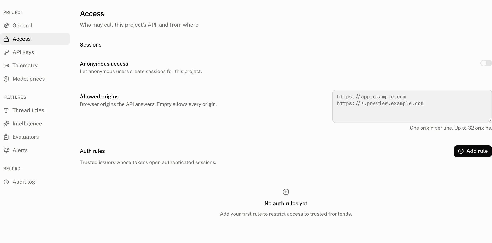

Allowed origins controls CORS on your project's frontend API host. It is a browser access rule, not an API key rule: the backend host is unaffected. An empty list allows every origin, which is the default for a new project.

## How the browser check works

For a request to the frontend project host, the cloud reads the project's allowed origin list and decides whether to reflect the request's `Origin` in `Access-Control-Allow-Origin`. An exact match is allowed. An empty list is also allowed for every origin.

The cloud caches each project's list for 60 seconds. A saved change can therefore take up to 60 seconds to reach a frontend request that uses the cached value.

The CORS response exposes the `Authorization` header to the browser. This lets an external JWT client read the refreshed internal token that the cloud returns in that header. A refused origin receives no `Access-Control-Allow-Origin` header, so the browser does not make the response available to the application.

### Wildcards match subdomains, not the base domain

`https://*.example.com` matches `https://app.example.com` and `https://preview.example.com`. It does not match `https://example.com`. A wildcard requires the same protocol and port as the browser origin, and the browser hostname must be a deeper subdomain of the wildcard suffix.

## Configure allowed origins



Open **Settings › Access**. The **Allowed origins** field accepts one origin per line, and **Save** appears after you change the value. Only an owner or admin can save this setting.

| Control | Default | Accepts | Effect |
|---|---|---|---|
| **Allowed origins** | Empty | One normalized browser origin per line, up to 32 entries | Defines which frontend browser origins receive a CORS response. Empty allows every origin. |

Each submitted entry is normalized and deduplicated before it is stored. An invalid entry refuses the save with the same message.

```text title="Invalid origin refusal"
Invalid allowed origin: {origin}
```

| Rule | What an entry must satisfy |
|---|---|
| 1 | It is not empty, is no more than 255 characters, and has no leading or trailing whitespace. |
| 2 | It has an `http` or `https` scheme and a host, with no path, query, or fragment in its written form. |
| 3 | It parses as a URL with pathname `/`, no search, no hash, no username, and no password. |
| 4 | A wildcard host begins with `*.` and has at least two non empty labels after it. No label after `*.` may itself be `*`. |
| 5 | Its scheme is `https`, except `http` is allowed for a non wildcard `localhost`, `127.0.0.1`, or `[::1]` origin. |
| 6 | A hostname contains no `*` except the leading wildcard described above. |
| 7 | It is stored as its URL origin. The port stays, and a trailing slash is removed. |

A list of more than 32 entries is refused with:

```text title="Origin count refusal"
At most 32 allowed origins are permitted
```

Saving creates an audit entry for the project configuration change. Use **Settings › Audit log** to review project configuration changes.

## Recipes

### Preview deployments

Allow every preview subdomain with one `https` wildcard entry:

```text title="Allowed origins"
https://*.preview.example.com
```

This permits `https://pr-42.preview.example.com`, but not `https://preview.example.com`. It also does not permit a preview on another port.

### Local development

Allow a local browser with a non wildcard loopback origin:

```text title="Allowed origins"
http://localhost:3000
```

`http` is permitted only for `localhost`, `127.0.0.1`, and `[::1]` without a wildcard. A public origin must use `https`.

### A port is part of the origin

Ports must match exactly. `https://app.example.com:3000` does not allow `https://app.example.com:3001`, and `https://*.example.com:3000` only matches subdomains on port `3000`.

## What a refused browser request sees

The frontend host still receives the request, but a nonmatching origin does not get `Access-Control-Allow-Origin`. Browser CORS then prevents your application from reading the response. This is distinct from API key authentication: API key clients use the backend host, which the allowed origins list does not restrict.

## Costs and limits

| Limit or behavior | Value |
|---|---|
| Allowed origins | 32 entries |
| Origin length | 255 characters |
| Origin list cache | 60 seconds per project |
| Empty list | Allows every origin |
| Wildcard scope | Same protocol and port, strictly deeper subdomain only |

## Troubleshooting

| What you see | Why | What to do |
|---|---|---|
| The browser blocks a frontend request after you restricted the list | The request origin has no exact or matching wildcard entry, so the response omits `Access-Control-Allow-Origin`. | Add the browser's full origin, or a matching wildcard, then wait up to 60 seconds for the cache. |
| A wildcard does not allow the base domain | `*.example.com` matches only deeper subdomains. | Add `https://example.com` as a separate exact entry when the base domain needs access. |
| A preview domain is still refused | Its protocol or port differs from the wildcard entry, or it is not a subdomain of the wildcard suffix. | Match the preview host's protocol and port exactly. |
| Saving `http://app.example.com` fails | Public origins must use `https`. | Use `https://app.example.com`; reserve `http` for the supported loopback hosts. |
| Saving an origin with a path fails | An allowed origin contains only scheme, host, and an optional port. | Remove the path, query, fragment, and any credentials. |
| Saving changes nothing for a member | Allowed origins is an owner and admin setting. | Ask an owner or admin to save the list. |
| A server key request is not fixed by adding an origin | Allowed origins controls CORS only on the frontend host. | Use the backend host and the required API key headers for server requests. |
