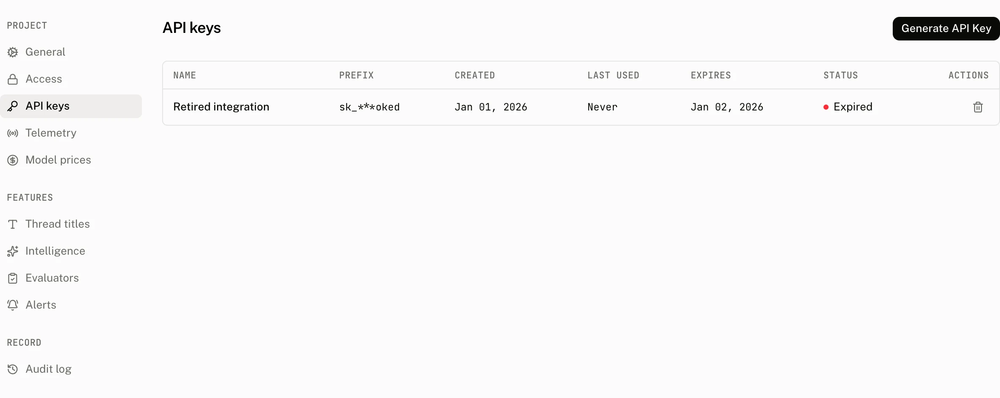

API keys authenticate a server to Assistant Cloud. A key has the form `sk_aui_proj_<project>_0…`; the cloud stores only its SHA 256 hash and retains the final four characters as its visible suffix. The dashboard shows the plaintext key once, at creation, so copy it into your server secret store before closing the dialog.

## How API keys authenticate a request

An API key is a bearer credential for `https://backend.assistant-api.com`. Every request also identifies who the server is acting for. `Aui-User-Id` defaults to `__SYSTEM__` when it is not sent. `Aui-Workspace-Id` is required on every key request except `POST /v1/traces`, where it defaults to `__OTLP__`.

The key lookup is scoped to the project encoded in the key. A missing hash match or an expiry at or before the request time refuses the request. The API writes `last_used_at` in the background at most once every five minutes for each key in an isolate, so it is an activity marker rather than a record of every call.

## Create and manage a key



Open **Settings › API keys** and select **Generate API Key**. A signed in member can create and revoke keys.

| Control | Default | Accepts | Effect |
|---|---|---|---|
| API key name | No default | 1 to 255 characters | A label for collaborators and the audit log. |
| Expires | Never | Never, 7 days, 30 days, 90 days, or 1 year | Sets the expiry, or leaves it unset for a key that does not expire. |

```text title="Key display rule"
Copy this key now. For security reasons it won't appear again.
```

The page's table is newest first. It never reads or displays key material.

| Column | What it shows |
|---|---|
| Name | The label chosen at creation. |
| Key | `sk_***` followed by the key's four character suffix. |
| Created | When the key was created. |
| Last used | The most recently recorded use, or *Never*. This is written at most once every five minutes per key in an isolate. |
| Expires | The expiry time, or *Never*. |
| Status | *Expired* when the expiry is at or before the current time, otherwise *Active*. |
| Actions | The Revoke action. |

**Revoke** permanently deletes the key. It cannot authenticate another request after deletion. Creation writes an `api_key.create` audit entry with the name and expiry. Revocation writes `api_key.delete` with the same fields.

## What a key can call

An API key can call the authenticated routes a browser runtime uses, while supplying its own user and workspace headers. The anonymous mint and refresh routes have their own anonymous authentication path and do not use API key authentication.

| Browser feature | Routes an API key can call |
|---|---|
| Threads | `POST /v1/threads`, `GET /v1/threads`, `GET`, `PUT`, and `DELETE /v1/threads/{thread_id}`, plus `POST /v1/threads/claim` |
| Messages | `POST` and `GET /v1/threads/{thread_id}/messages`, `DELETE /v1/threads/{thread_id}/messages`, `PUT /v1/threads/{thread_id}/messages/{message_id}`, and `POST /v1/threads/{thread_id}/messages/{message_id}/feedback` |
| Runs | `POST /v1/runs` and `POST /v1/runs/stream` |
| Scores and events | `POST /v1/scores` and `POST /v1/events` |
| Attachments | `POST /v1/files/attachments/generate-presigned-upload-url` and `POST /v1/files/attachments/generate-presigned-download-url` |

Some routes accept an API key and no browser credential. Use them only from a server.

| API key only route | Purpose |
|---|---|
| `POST /v1/auth/tokens` | Create an internal token from the backend. |
| `POST /v1/traces` | Receive OTLP traces. |
| `POST /v1/mcp` | Serve the MCP endpoint. |
| `GET /v1/projects/threads` | Read project threads. |
| `GET /v1/projects/threads/{thread_id}/messages` | Read a project's thread messages. |
| `GET /v1/projects/scores` | Read project scores. |
| `GET /v1/projects/runs` and `GET /v1/projects/runs/{run_id}` | Read project runs. |
| `GET /v1/projects/usage/daily` and `GET /v1/projects/usage/period` | Read project usage. |
| `DELETE /v1/projects/users/{user_id}` | Erase a project user. |

## From your code

Construct the client on your server. The API key configuration defaults to the backend host, and sends the three authentication headers on every request.

```ts title="app/lib/cloud.ts"
import { AssistantCloud } from "assistant-cloud";

export function accountCloud(userId: string, workspaceId: string) {
  return new AssistantCloud({
    apiKey: process.env.ASSISTANT_API_KEY!,
    userId,
    workspaceId,
  });
}
```

Pass the user and workspace that the request should act for, rather than treating a key as an end user identity. A server tool should have its own named key, expiry choice, and secret. This lets you revoke that tool's access without replacing another server's key.

```ts title="app/api/threads/route.ts"
const cloud = accountCloud(account.id, account.workspaceId);
const { threads } = await cloud.threads.list();

return Response.json({ threads });
```

The client sends these headers:

```http title="API key request"
GET /v1/threads
Authorization: Bearer sk_aui_proj_…
Aui-User-Id: user_123
Aui-Workspace-Id: workspace_123
```

## Request refusals

The backend host binding applies after the key is recognized. These are the authentication errors an API key request can receive.

| Status | Exact response | Cause |
|---|---|---|
| `401` | `Authorization header is missing` | No `Authorization` header was sent. |
| `401` | `Authorization header must begin with "Bearer "` | The header does not begin with the required bearer scheme. |
| `403` | `Unsupported authorization value` | The bearer value is neither an API key nor a JWT. |
| `403` | `Invalid API key format` | The key cannot supply a valid project id. |
| `403` | `Unknown or expired API key` | The key hash is not found for that project, or the key has expired. |
| `403` | `Invalid Aui-User-Id header` | `Aui-User-Id` is empty, too long, or contains whitespace or control characters. |
| `403` | `Invalid Aui-Workspace-Id header` | `Aui-Workspace-Id` is missing where required, empty, too long, or contains whitespace or control characters. |
| `403` | `Origin does not match project ID` | The request did not reach the backend host expected for this API key. |

## Costs and limits

| Limit or behavior | Value |
|---|---|
| Visible key suffix | 4 characters |
| Key name | 1 to 255 characters |
| Expiry choices | Never, 7 days, 30 days, 90 days, or 1 year |
| Last used write | At most once every five minutes per key in an isolate |
| Revocation | Hard delete |

Keep API keys out of browser bundles and client environment variables. A browser request has its own frontend authentication modes, while a key request is bound to the backend host and can act in any user and workspace you put in its headers.

## Troubleshooting

| What you see | Why | What to do |
|---|---|---|
| The key worked yesterday and now returns `Unknown or expired API key` | The key was revoked, deleted, or has reached its expiry. | Create a replacement in **Settings › API keys**, update the server secret, and revoke the old key only after the replacement is live. |
| The dashboard still says *Never* or shows an older last used time | The write is throttled to once every five minutes per key in an isolate. | Treat Last used as a recent activity signal, not a per request audit. |
| A request returns `Origin does not match project ID` | The key was sent to a frontend project host instead of the backend host. | Use the default API key client base URL, or explicitly use `https://backend.assistant-api.com`. |
| A non trace request returns `Invalid Aui-Workspace-Id header` | The server did not send a valid workspace id. | Pass `workspaceId` when constructing `AssistantCloud`. |
| A request acts as `__SYSTEM__` | `Aui-User-Id` was omitted. | Pass `userId` when constructing `AssistantCloud` when the request should act as a user. |
| A key is exposed in client code | API keys are backend credentials and their plaintext is shown only once. | Revoke the exposed key, create a replacement, and keep it in a server only secret store. |
