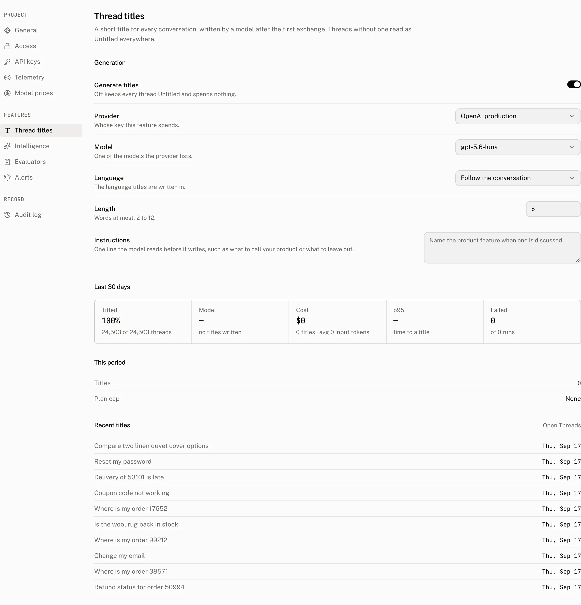

A model names each conversation that has a user message with text, from that message, so a thread list reads as a list of subjects rather than a list of dates. A thread without a title reads *Untitled* in the dashboard and shows your thread list's fallback in the app, *New Chat* in the assistant-ui components. Titles are a project feature: **Settings › Thread titles** chooses the model, the language and the length, and the same page shows what the feature did and what it cost.

## How a thread gets its title

The cloud writes the title itself, in the background of the request that gives the thread its first user message. Three things can start a title:

| Trigger | When it fires |
|---|---|
| The runtime asks | `POST /v1/runs/stream` with `assistant_id: "system/thread_title"`. The assistant-ui runtimes send it once per thread, as soon as the cloud thread exists, with the messages the thread holds at that moment, which on a new thread is the user's message alone. |
| The user message is stored | `POST /v1/threads/{thread_id}/messages` with `role: "user"`, on a thread that has no title yet. The title is written from the stored messages. |
| The hourly sweep | Once an hour, over the untitled threads of the last seven days that a request missed or failed on. |

The run report, the trace receiver and a hosted assistant run start nothing. Every trigger runs the same check, which reads stored rows only:

- The thread has no title. A title of spaces counts as none.
- The thread holds a user message with text. A thread whose first user message is an image alone never qualifies.
- No attempt is running, and the trigger's attempt budget is not spent; see [One title per thread](#one-title-per-thread).

### What the model reads

The first user message, and the first assistant message when one is already stored, and only their text parts. Tool calls, reasoning, sources and attachments are left out. The user's text alone may fill 8,000 characters. When a reply is stored, the two texts share that budget: the reply keeps up to 500 characters of it, the user's message takes the rest, and both are cut at their limit.

### The model call

The call runs on the provider chosen in Settings, or on the assistant-ui gateway with `gpt-5.6-luna` when no provider is chosen. The system prompt is:

```text
Write a title for this conversation. At most 6 words, in the language the user writes in, no quotes and no trailing punctuation. Name the subject, not the assistant.
```

*6 words* is the Length setting, *the language the user writes in* becomes *the language with code de* when a language is fixed, and the Instructions setting is appended as a second line. The model must answer through a `setTitle` tool whose only argument is a title of 1 to 255 characters, with 256 output tokens at most and a five minute timeout. A model that returns no title is asked once more, and the tokens of both attempts are counted together.

### One title per thread

Every attempt is claimed inside a transaction that locks the thread row and records the attempt as a run the cloud made for itself, with `status: "running"` and its trigger, `sdk`, `message` or `sweep`, in `attributes["title.trigger"]`. The claim gives up when the thread has gained a title in the meantime, when an attempt is still running, or when the trigger's budget is spent, so the three triggers cannot title a thread twice and an automatic title never replaces one you set. A request trigger makes only a thread's first attempt. The hourly sweep retries threads whose attempts failed, up to three attempts per thread, and an attempt still marked running after ten minutes counts as abandoned. A thread whose title run ended in a provider error is therefore retried within the hour, and gives up after the third failure.

### When the title reaches your app

The runtime's own request goes out when the cloud thread is created, with the user's message, and the cloud answers it with the title as it streams from the model, so the assistant-ui thread list shows the title before the response has finished. A thread the cloud titles on its own, after a user message stored by a server or by the hourly sweep, shows its title in an app when the thread list next loads. Runtimes that keep their transcripts elsewhere, LangGraph, LangChain and Google ADK, are titled the same way, because the request carries the user's message and nothing else is needed.

## Configure



| Control | Default | Accepts | Effect |
|---|---|---|---|
| Generate titles | On | | Off keeps every thread Untitled, spends nothing, and takes the project out of the sweep. |
| Provider | *assistant-ui gateway* | One of the project's [LLM providers](/docs/cloud/llm-providers) | Whose key the titles spend, and whether they count against the plan; see [Costs and limits](#costs-and-limits). |
| Model | The first model on the provider's Models list | Any model id of 1 to 255 characters, typed or picked from the provider's list, whose suggestions are ordered for tool calling; see [how model discovery works](/docs/cloud/llm-providers#how-model-discovery-works). Saving with titles on is refused with `Choose a model for this provider` only when the field is empty and the provider's list is empty. | The model that writes the title. |
| Language | Follow the conversation | The twelve languages in the list. The API accepts `auto` or a language tag such as `pt-BR`, matching `^[a-z]{2,3}(-[A-Za-z]{2,4})?$`. | Names the language in the prompt. |
| Length | 6 | 2 to 12 whole words | The word limit in the prompt. |
| Instructions | Empty | Up to 1,000 characters, trimmed | Appended to the prompt as a second line, for instance what to call your product or what to leave out. |

**Save** appears once a field differs from what is stored, and every save writes an audit log entry with the fields that changed. Any member of the organization may change these settings.

### What the page shows

**Last 30 days** reads the threads created in the range and the title runs made in it.

| Tile | Reading |
|---|---|
| Titled | The share of threads created in the range that have a title, whoever wrote it. |
| Time to title | The median time from a thread's creation to its title, with the 90th percentile as the baseline. |
| Model | The model that wrote the most titles, with its share when more than one did. |
| Cost | The cost of every title run in the range, and the average input tokens of a run. |
| p95 | The time under which 95 percent of model calls finished, measured on the call alone. |
| Failed | Title runs that did not complete. |

**This period** is the plan's view of the current UTC calendar month: the titles written on the gateway against the number the plan includes, the plan's cap, and *Paused since* with an **Upgrade** button once the cap is reached. **Recent titles** lists the ten newest titled threads.

**How titles arrive** counts the titles of the range by trigger: *Client request*, *First message*, *Hourly sweep*, and *Before tracking* for titles written before the trigger was recorded. **Untitled threads** counts the threads of the range without a title by state: *Waiting for the hourly sweep*, *Being written*, *Failed, retrying*, *Gave up* and *No user text*, for a thread whose user messages hold no text, a file alone included. While titles are off or the plan cap is reached, the section shows one row instead, *Titles are off* or *Paused by the plan cap*, with the number of untitled threads in the range. A thread's own page shows its state in the Title row of its Details rail; see [Threads page](/docs/cloud/dashboard/threads#inspect-one-thread).

## From your code

The thread list renders whatever the cloud holds. The title primitive takes a fallback for the time before a title exists, and the assistant-ui thread list uses *New Chat*:

```tsx
<ThreadListItemPrimitive.Title fallback="New Chat" />
```

A thread can be renamed, and a title can be requested, from the thread list item:

```tsx title="thread-title-actions.tsx"
import { useAui } from "@assistant-ui/react";

export function ThreadTitleActions() {
  const aui = useAui();
  const rename = () => aui.threadListItem().rename("Refund for order 1042");
  const generateTitle = () => aui.threadListItem().generateTitle();

  return (
    <>
      <button onClick={rename}>Rename</button>
      <button onClick={generateTitle}>Generate title</button>
    </>
  );
}
```

`rename` writes the title at once, and a rename wins over an automatic title still in flight. `generateTitle` sends the thread's messages to the cloud and applies the title that streams back. On a thread that already has a title it receives that title again, unchanged; rename to change a title.

Outside the runtime, the title is a field of the thread:

```ts
await cloud.threads.update(threadId, { title: "Refund for order 1042" });
```

```http
PUT /v1/threads/thread_0…
Authorization: Bearer <token>
Content-Type: application/json

{ "title": "Refund for order 1042" }
```

The request the runtime makes is available to any client. It answers the title as plain text, and streams the stored title back when the thread already has one:

```http
POST /v1/runs/stream
Authorization: Bearer <token>
Accept: text/plain
Content-Type: application/json

{
  "thread_id": "thread_0…",
  "assistant_id": "system/thread_title",
  "messages": [
    { "role": "user", "content": [{ "type": "text", "text": "My order 1042 arrived damaged" }] }
  ]
}
```

`generateThreadTitle(cloud, { threadId, messages })` from `assistant-cloud` makes this call and writes the title it receives to the thread. A server that stores threads with an API key needs none of this: its threads are titled when it stores the user message.

## Costs and limits

Every title is a run the cloud made for itself. It is stored with its tokens, duration and cost, and excluded from every conversation figure, from the Runs page and from the project read API, so titles never distort your numbers.

| Provider | Counted against | Priced |
|---|---|---|
| The assistant-ui gateway | The plan's monthly allowance: Free includes 500 titles a month and stops there, Pro includes 5,000 and stops at 50,000, Startup and Enterprise have no limit. At the cap the feature pauses for the rest of the UTC month and the page reads *Paused since*. | From the catalog, at the gateway's own rate. |
| One of your providers | Nothing. Titles on your own key are counted and never limited. | From the catalog and your [model price overrides](/docs/cloud/settings/model-prices), and listed on Billing › Usage as *Thread titles on your key*. |

The title lives on the thread and goes with it when [retention](/docs/cloud/retention) deletes the thread. The monthly count survives retention, since it is what the plan reads.

| Limit | Value |
|---|---|
| Title | 255 characters |
| Input the model reads | 8,000 characters, of which the reply keeps up to 500 |
| Length setting | 2 to 12 words |
| Instructions | 1,000 characters |
| Model call | 256 output tokens, five minutes |
| Sweep | Every hour, untitled threads of the last seven days, newest first, at most 500 candidates and 200 attempts per pass across every project, 3 attempts per thread |

## Troubleshooting

| What you see | Why | What to do |
|---|---|---|
| Every thread is Untitled | Generate titles is off. | Turn the feature on in **Settings › Thread titles**. |
| New threads stopped getting titles this month | The gateway allowance is used up; *This period* reads *Paused since*. | Upgrade the plan, or choose one of your providers, which is never limited. |
| The thread is titled in the dashboard but the app still shows New Chat | The app does not send the runtime's title request, so the cloud titled the thread on the stored user message and the app's list has not reloaded. | Reload the list, or call `generateTitle()`, which returns the stored title. |
| A thread whose first message was an image alone is Untitled | The title needs a user message with text. | Rename it. |
| The Failed tile is not zero | The provider refused the call, for instance an invalid key or a model the account cannot use. The hourly sweep retries a failed thread up to three times. | Fix the provider; the sweep titles the affected threads within the hour. A thread that reads *Gave up* on its page has used its three attempts and needs a rename. |
| Titles are in the wrong language | Language is fixed to one language, or the first message was written in another. | Set Language to *Follow the conversation*. |
| Titles are too long or too short | Length is the word limit the model is given. | Set Length between 2 and 12. |
| A title you set was replaced | `generateTitle()` never replaces a title, and an automatic attempt gives up once a title exists; only a rename or a thread update through the API writes over it. | Look for the client or server call that wrote it. |
