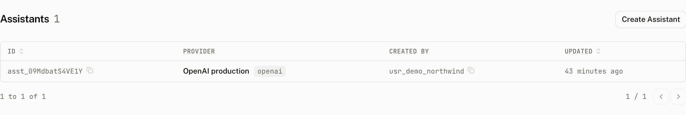

<Callout type="warning" title="Preview">
Assistants are in preview. The dashboard marks the Build section as preview, and their APIs and data may change without notice.
</Callout>

An assistant is a stored model configuration bound to one of the project's [LLM providers](/docs/cloud/llm-providers). Your client names that assistant in a run request, and the cloud calls the provider on your behalf and records the result against the thread.

The Assistants list shows the provider, provider type, creator, and last update for up to 100 assistants, newest updated first. Open an assistant to change its configuration, copy its id, or see the facts that govern its runs.

## How it works

The assistant stores a provider id and a configuration containing the model, model settings, system prompt, tool names, and optional step and timeout settings. When a request selects it, the cloud joins the assistant to its provider, decrypts the provider credentials, and calls the provider using its Responses API.

The request's `system` value is merged after the stored system prompt. Empty values do not add a separator:

```text title="System prompt merging"
[stored system prompt, request system].filter(Boolean).join("\n\n")
```

The request's frontend tools are merged into the provider call. The cloud stops after the configured step limit, or 10 steps when none is stored, and cuts the run off after the configured timeout, or 300 seconds when none is stored.

Every assistant run records a run with source `server`, its spans, thread run linkage, and the daily run aggregate. The record can have status `completed`, `incomplete`, or `error`. A noncompleted assistant run records `timeout`, `aborted`, `rate_limited`, `provider_error`, or `server_error` when that condition is known; an incomplete stream with no captured error has no reason. A completed assistant run can trigger a thread title after the first completed thread run.

The cost uses the project price overrides and the provider's catalog key. If the provider has no catalog key, its provider type is used instead.

## Configure



| Control | Default | Accepts | Effect |
|---|---|---|---|
| **Provider** | None | A provider in the project | Selects the provider whose credentials and price key the run uses. |
| **Model** | None | Any model id of 1 to 255 characters, typed or picked from the provider's list, whose suggestions are ordered for tool calling; see [how model discovery works](/docs/cloud/llm-providers#how-model-discovery-works). | Stores the provider model name. |
| **Temperature** | 0.7 | 0 to 2 in steps of 0.1, on create and on update. | Stores the model temperature. |
| **Top P** | 1.0 | 0 to 1 in steps of 0.1 | Stores the model `topP` value. |
| **Max steps** | 10 when blank | Whole numbers from 1 to 50 | Limits tool call rounds before the run stops. |
| **Timeout** | 300 seconds when blank | Whole numbers from 30 to 600 seconds | Cuts off and records a run that exceeds the limit. |
| **System prompt** | Empty | Optional text | Supplies the first part of the system prompt sent to the provider. |

**Advanced settings** is collapsed at first and contains Temperature, Top P, Max steps, and Timeout. If the project has no providers, the form asks you to add an LLM provider first.

### What the page shows

The assistant detail page has a copyable id, its model as a link to the Models page, and a **Configuration** section containing the form. Its **Facts** rail shows Created, Updated, Provider, Model, Max steps, and Timeout. Max steps and Timeout show their run defaults when those values are not stored.

Choose **Delete** to remove the assistant. The confirmation says the action cannot be undone, and the change is recorded as `assistant.delete` in the audit log. A provider that an assistant still uses cannot be deleted. The dashboard answers: `This provider is currently in use by one or more assistants. Please update or delete the assistants using this provider first.`

An Intelligence task's skill is reviewed text published in the task page's **Skill** section. **Publish**, **Update**, and **Unpublish** manage it there. Publishing needs no assistant or LLM provider. **Create assistant** remains a secondary action that links an assistant to the task and records `task.skill.create` in the audit log. See [Intelligence](/docs/cloud/intelligence) for the skill flow.

## From your code

Run an assistant from the browser with `useCloudRuntime`, or from your server by posting the run yourself.

In the browser, `useCloudRuntime` from `@assistant-ui/react-data-stream` runs the assistant on the active thread and keeps the thread list and its messages in Assistant Cloud. Frontend tools registered with the runtime run in the browser, and their results go back to the assistant on the next step.

```tsx title="assistant.tsx"
"use client";

import { useMemo } from "react";
import { AssistantRuntimeProvider } from "@assistant-ui/react";
import { useCloudRuntime } from "@assistant-ui/react-data-stream";
import { AssistantCloud } from "assistant-cloud";
import { Thread } from "@/components/assistant-ui/elements/thread.aui";

export function Assistant() {
  const cloud = useMemo(
    () =>
      new AssistantCloud({
        baseUrl: process.env.NEXT_PUBLIC_ASSISTANT_BASE_URL!,
        anonymous: true,
      }),
    [],
  );
  const runtime = useCloudRuntime({ cloud, assistantId: "assistant_…" });

  return (
    <AssistantRuntimeProvider runtime={runtime}>
      <Thread />
    </AssistantRuntimeProvider>
  );
}
```

From a server, create the thread with the API key client and post the run yourself. The response is a UI message stream, the same server sent events the AI SDK emits, so it can be forwarded to a browser or read line by line:

```ts title="run-assistant.ts"
import { AssistantCloud } from "assistant-cloud";

const identity = { userId: "bot_orders", workspaceId: "bot_orders" };
const cloud = new AssistantCloud({
  apiKey: process.env.ASSISTANT_API_KEY!,
  ...identity,
});
const { thread_id } = await cloud.threads.create({ last_message_at: new Date() });

const response = await fetch("https://backend.assistant-api.com/v1/runs/stream", {
  method: "POST",
  headers: {
    Authorization: `Bearer ${process.env.ASSISTANT_API_KEY}`,
    "Aui-User-Id": identity.userId,
    "Aui-Workspace-Id": identity.workspaceId,
    "Content-Type": "application/json",
    Accept: "text/event-stream",
  },
  body: JSON.stringify({
    thread_id,
    assistant_id: "assistant_0…",
    response_format: "vercel-ai-data-stream/v1",
    messages: [
      { role: "user", content: [{ type: "text", text: "Where is order 1042?" }] },
    ],
  }),
});

const decoder = new TextDecoder();
for await (const chunk of response.body!) {
  process.stdout.write(decoder.decode(chunk, { stream: true }));
}
process.stdout.write(decoder.decode());
```

The request underneath is `POST /v1/runs/stream`. `Accept` is required and must be exactly `text/plain` or `text/event-stream`. To execute a normal assistant, set `response_format` to `vercel-ai-data-stream/v1`; that response is a UI message stream.

```http title="Run an assistant"
POST /v1/runs/stream
Authorization: Bearer <token>
Accept: text/event-stream
Content-Type: application/json

{
  "thread_id": "thread_0…",
  "assistant_id": "assistant_0…",
  "response_format": "vercel-ai-data-stream/v1",
  "messages": [
    {
      "role": "user",
      "content": [{ "type": "text", "text": "Where is order 1042?" }]
    }
  ],
  "tools": {},
  "system": "Answer with the current delivery estimate.",
  "trace_id": "trace_0…"
}
```

`thread_id`, `assistant_id`, and `messages` are required. Each message has role `system`, `user`, or `assistant`, with a `content` array whose blocks include a `type`. `tools`, `system`, and `trace_id` are optional. `trace_id` is 1 to 48 characters. The route accepts extra body fields, but it validates the message structure before calling the assistant.

| Status | Body | When |
|---|---|---|
| `200` | Stream | The assistant run starts. |
| `400` | `Invalid messages format: <zod message>` | A message does not have a supported role and content array. |
| `400` | `Invalid response format` | `response_format` is not `vercel-ai-data-stream/v1` for a normal assistant. |
| `400` | `{ "success": false, "error": … }` | `Accept` is missing or is not `text/plain` or `text/event-stream`, or a required field fails validation. |
| `400` | `Provider base URL must be a valid URL`, `Provider base URL must use HTTPS`, `Provider base URL must use HTTP or HTTPS`, or `Provider base URL must not target a private or loopback address` | The assistant's provider base URL fails the outbound URL check. |
| `404` | `Thread not found` | The thread is not in the caller's workspace. |
| `404` | `Assistant not found` | The assistant does not exist in the project. |

## Costs and limits

The provider's key pays for every assistant run. The cloud resolves the price using the provider's catalog key and the project's model price overrides, falling back to the provider type when the provider has no catalog key.

| Limit | Value |
|---|---|
| Assistant id accepted by the dashboard | 1 to 48 characters |
| Model name | 1 to 255 characters |
| Max steps | 1 to 50, default 10 |
| Timeout | 30 to 600 seconds, default 300 seconds |

## Troubleshooting

| What you see | Why | What to do |
|---|---|---|
| The assistant form says to add an LLM provider first | The project has no provider for an assistant to use. | Add a provider, then create the assistant. |
| A provider cannot be deleted | One or more assistants still reference it. | Update or delete every assistant using the provider. |
| The request returns `Invalid response format` | A normal assistant run needs `vercel-ai-data-stream/v1`. | Set `response_format` to `vercel-ai-data-stream/v1`. |
| The request returns `Invalid messages format` | A message is missing a supported role or content array. | Send `system`, `user`, or `assistant` messages with content blocks that include `type`. |
| The request returns `Assistant not found` | The id does not identify an assistant in this project. | Copy the assistant id from its detail page and use it with the same project. |
| A run stops after tool calls | The stored step cap, or its default of 10, was reached. | Raise Max steps, up to 50. |
| A run is recorded as a timeout | The stored timeout, or its default of 300 seconds, elapsed. | Increase Timeout, up to 600 seconds. |
