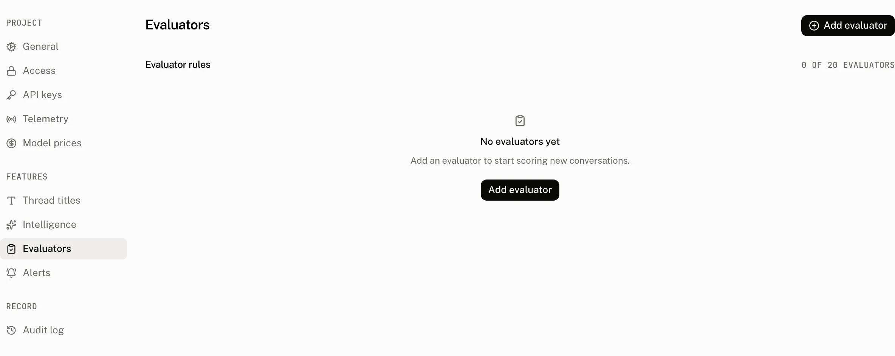

An evaluator is a model judge that scores conversations against a rule you define. Each verdict is stored as a score with the source `evaluator`, so it stays distinct from end user, human, and API scores.

Rules are configured in **Settings › Evaluators**. An enabled rule can use a provider and model you choose, and its sampling rate determines the share of new conversations that the worker evaluates.

## Configure evaluator rules

| Field | Default | Accepts | Refusal or effect |
|---|---|---|---|
| Name | None | Trimmed text from 1 to 64 characters. Letters, numbers, periods, underscores, and hyphens only. | Invalid characters show `Use letters, numbers, periods, underscores, or hyphens`. A name cannot change after the rule has verdicts. |
| Description | Empty | Optional trimmed text. | Free text shown with the rule. |
| Prompt | None | Trimmed text from 1 to 4,000 characters. | The question or criterion the model judge applies. |
| Data type | None | `numeric`, `categorical`, or `boolean`. | Sets the shape of the verdict. Categories are stored only for `categorical`. |
| Categories | Empty | For a categorical rule, 1 to 10 distinct trimmed labels. | A categorical evaluator without a category is refused with `Categorical evaluators need at least one category`. Duplicate labels are refused with `Categories must be distinct`. |
| Sampling rate | 100% | A number from `0.01` to `1`. | Selects the share of new conversations that the rule judges. `0.01` is 1% and `1` is 100%. |
| Enabled | On | On or off. | Controls whether the rule participates in worker evaluation. |
| Provider | Empty | Optional provider id from 1 to 48 characters. | Must be paired with a model. A provider without a model is refused with `Enter a model for the selected provider`. |
| Model ID | Empty | Optional model id from 1 to 255 characters, typed or picked from the provider's Models list, which is all the field suggests. | Must be paired with a provider. A model without a provider is refused with `Select a provider for the evaluation model`. |

Each project can have at most 20 evaluator rules. Creating another rule is refused with `A project can have at most 20 evaluators`.

## Manage verdicts

A rule name becomes fixed once it has verdicts. Renaming it is refused with `An evaluator name cannot change after verdicts exist`, which preserves the meaning of the score name already written to conversations.

Deleting a rule deletes the scores it authored with `source: "evaluator"` in the same transaction, then removes the rule. This removes its verdict history rather than leaving scores that no longer have a rule.

The evaluator list counts verdicts from the last 28 days. Its summaries are grouped by the rule's data type:

| Data type | Summary |
|---|---|
| Boolean | `true_count` and `false_count` |
| Numeric | Count, average, minimum, and maximum |
| Categorical | Count and up to 10 label totals |

## Where verdicts appear

Verdicts appear in the **Evaluator verdicts** section of [Intelligence](/docs/cloud/intelligence), in the score views on a run and a thread, and in the project read API. The `list_scores` MCP tool accepts `source: "evaluator"` to return only evaluator verdicts. It also accepts filters for thread, run, and score name, and returns scores with a cursor.

Evaluators are available on Pro, Startup, and Enterprise plans. A project without the feature cannot read or write evaluator rules.

## Troubleshooting

| What you see | Why | What to do |
|---|---|---|
| The evaluator cannot be renamed | The rule already has verdicts. | Keep its existing name, or create a new rule when you need a different score name. |
| A categorical rule will not save | It has no category, or two categories are the same after trimming. | Add 1 to 10 distinct category labels. |
| A provider or model field is refused | Provider and model must be selected together. | Select both fields, or leave both empty. |
| A new rule is refused | The project already has 20 evaluator rules. | Delete an unused rule, understanding that its evaluator verdicts are deleted with it. |
| The summary is lower than expected | The list counts verdicts from the last 28 days, and the sampling rate selects only part of new conversations. | Check the rule's sampling rate and use the Intelligence, thread, or run score views to inspect the matching verdicts. |
