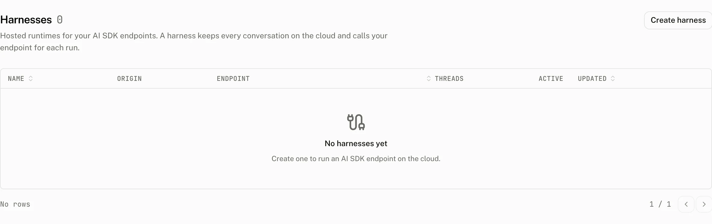

<Callout type="warning" title="Preview">
Harnesses are in preview. The dashboard marks the Build section as preview, and their APIs and data may change without notice.
</Callout>

A harness is a hosted runtime for an AI SDK endpoint at its own origin. Conversations stay on the cloud, and the hosted proxy calls your endpoint for each run.

The Harnesses page lists each harness's origin, backend, thread count, active count, and last update. Open a harness to connect an app, configure which endpoints the proxy may call, and observe its live instances and conversation ledger.

## How it works

The harness origin is built from the harness id and the configured harness domain. A browser connects to that origin with a credential and a cloud workspace and thread identity. For every run, the proxy chooses an allowed backend endpoint and calls your AI SDK route while the conversation remains in Assistant Cloud.

Harnesses need two forms of availability. The hosted harness service must be enabled for the dashboard, and the project plan must include the `harnesses` feature. When the service is unavailable, Harnesses is absent from the sidebar, the pages are unavailable, and reads or writes answer `Hosted harnesses are not enabled`. When a project lacks the plan feature, the page shows its plan required state and the project cannot read or change harnesses.

## Configure



Create a harness by entering a trimmed name from 1 to 80 characters. The cloud creates an AI SDK harness with a generated id of 21 lowercase letters and digits, an empty endpoint allowlist, and **Allow localhost** on.

| Control | Default | Accepts | Effect |
|---|---|---|---|
| **Allowed endpoints** | Empty | Up to 16 public HTTPS endpoint entries | Sets the backend allowlist for AI SDK runs. |
| **Allow localhost** | On | On or off | Lets the open dashboard page serve `http://localhost:<port>` endpoints. |
| **Realtime Voice Provider** | Off | An OpenAI provider in the project | Selects the provider used for realtime voice. |

Endpoint entries are trimmed, empty entries are discarded, and duplicates collapse to one entry. An entry is an absolute HTTP or HTTPS origin with an optional path prefix and an optional leading `*.` hostname wildcard. A public, nonloopback endpoint must use HTTPS. `*.example.com` matches subdomains, and a path prefix limits the part of the endpoint that may be called.

| Refusal | Message |
|---|---|
| More than 16 entries | `backendUrls must have at most 16 entries` |
| Not an absolute HTTP or HTTPS origin with the allowed wildcard and path prefix shape | `backend allowlist entry must be an absolute http(s) origin with an optional path prefix: {entry}` |
| Host cannot be parsed | `backend allowlist entry has an invalid host: {entry}` |
| A loopback host appears in the allowlist | `localhost is governed by Allow localhost, not the allowlist: {entry}` |
| A public endpoint uses HTTP | `backendUrl must use https: {url}` |
| A public endpoint resolves to a private host | `backendUrl must not point at a private host: {url}` |
| The selected voice provider is not OpenAI | `Voice needs an OpenAI provider` |

Loopback hosts, including `localhost`, any `127.x.x.x` address, and `::1`, belong only behind **Allow localhost**. **Realtime Voice Provider** lists Off and the project's OpenAI providers, and saves its choice immediately.

### What the page shows

The detail page has **Connect**, **Observe**, and **Configure** tabs. Its **Facts** rail shows the copyable Origin and Harness ID, Type as AI SDK, Voice as the provider name or Off, Credentials, Anonymous access, Created, and Updated.

The **Connect** tab offers an assistant-ui snippet and an Other snippet; the tab fills in the harness origin and the endpoint path. In both, `url` is the path of the first allowed endpoint, or `/api/chat` when the allowlist is empty. `origin` is the harness origin. `credential` is a project API key or a token minted with `POST /v1/auth/tokens`. `workspaceId` identifies the workspace whose conversations are opened. The Other snippet also takes `threadId`, the conversation to open; the assistant-ui snippet lists the workspace's threads instead.

```tsx title="assistant-ui"
import { AuiConfig, AuiProvider } from "@assistant-ui/react";
import { HarnessThread, HarnessCloudThreadList } from "@assistant-ui/react-harness-sdk";

const config = AuiConfig({
  threads: HarnessCloudThreadList({
    url: "/api/chat",
    origin: "https://harness.example.com",
    credential: () => fetchCredential(),
    workspaceId: "ws_...",
  }),
});

export function Chat() {
  return (
    <AuiProvider config={config}>
      <HarnessThread />
    </AuiProvider>
  );
}
```

```tsx title="Other"
import { useHarness, HarnessCloud } from "harness-sdk";

const { messages, sendMessage } = useHarness({
  transport: HarnessCloud({
    url: "/api/chat",
    origin: "https://harness.example.com",
    credential: () => fetchCredential(),
    workspaceId: "ws_...",
    threadId,
  }),
});
```

`@assistant-ui/react-harness-sdk` is not published during the preview, and the `harness-sdk` release on npm does not include `HarnessCloud` yet, so these snippets show the API the Connect tab hands out, not an install you can run yet.

## Costs and limits

Harnesses are available on the following plans. Plan limits can also be overridden for a project.

| Plan | Harnesses | Cap |
|---|---|---|
| Free | Not included | 0 |
| Pro | Included | 5 |
| Startup | Included | 25 |
| Enterprise | Included | No cap |

When a project's plan loses the feature, the cloud suspends every harness in that project. When the plan regains the feature, it clears that suspension and restores the harnesses. Creation rechecks the plan and cap inside its transaction. At the cap, the dashboard refuses creation with `This plan includes {n} harness` or `This plan includes {n} harnesses`.

## Observe runs and conversations

**Live instances** shows the instances the hosted proxy holds for the harness. A client attached to a thread or thread list makes an instance appear, and an instance stays for five minutes after its last client leaves. The page polls every 5 seconds, waits 30 seconds after an error, and does not retry automatically.

| Column | Meaning |
|---|---|
| Instance | The instance id, linked to its mirrored thread when there is one. |
| Kind | `thread` or `thread list`. |
| Connections | Current client connections. |
| Tasks | Current tasks. |
| Idle | Whether the instance is idle. |
| Active since | When the instance became active. |

The live status shows the total connections and pulses while that total is above 0. If no client is attached, the empty state explains that no instance is active. If the registry is unavailable, the page shows `The registry is unreachable` and a Retry action. If the registry is not configured, the Live section is not shown.

The threads ledger lists the 50 most recently updated harness thread rows and shows `{active} active, {total} total`.

| Column | Meaning |
|---|---|
| Thread | Copyable thread id. |
| Workspace | The thread's workspace. |
| Title | The title, or Untitled when it is null. |
| Activity | `running`, `waiting`, `error`, or `idle`. Running is live, waiting is a warning, error is danger, and idle is neutral. |
| Status | An archived badge when the thread is archived. |
| Updated | The thread's latest update. |

## Deleting a harness

Choose **Delete** to stop threads on the harness and remove their cloud history. Deletion removes the harness thread records as well. The audit log records `harness.create`, `harness.update`, and `harness.delete`; the delete entry includes the harness name, endpoints, localhost setting, and voice provider.

## Troubleshooting

| What you see | Why | What to do |
|---|---|---|
| Harnesses is absent from the sidebar | The hosted harness service is not enabled on this dashboard. | Harnesses are part of the hosted dashboard; there is nothing to enable on your side. |
| The page shows a plan required state | The project plan does not include the `harnesses` feature. | Change to a plan that includes Harnesses. |
| Creation is refused at the cap | The project already has its plan's maximum number of harnesses. | Delete a harness or use a plan with a larger cap. |
| `localhost is governed by Allow localhost, not the allowlist` | A loopback host was added to Allowed endpoints. | Remove it from the allowlist and turn on **Allow localhost**. |
| `backendUrl must use https` | A public backend uses HTTP. | Use an HTTPS endpoint. |
| `Voice needs an OpenAI provider` | The selected provider is not OpenAI. | Select an OpenAI provider or turn voice off. |
| Live instances do not load | The harness registry cannot be reached. | Use Retry after the registry is available. |
| No live instance appears | No client is attached to a thread or thread list. | Open the harness from a client and connect to a thread or thread list. |
