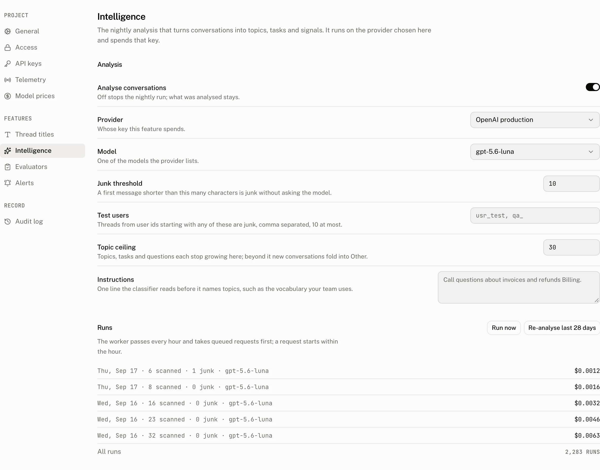
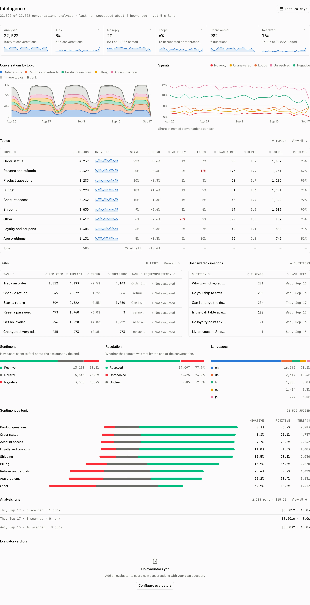

Intelligence reads your conversations with the provider and model selected in Settings. It turns the result into topic, task, question, and conversation level signals that help you find what users ask for and where the assistant falls short.

The default Intelligence range is 28 days. Its dashboard views link the aggregate figures back to the matching conversations, so you can move from a trend to the threads behind it.

## What Intelligence produces

| Result | What it means | Where it appears |
|---|---|---|
| Topics | The subjects that conversations are about. Each topic has its threads, share of the range, trend, and related rates. | **Conversations by topic**, **Topics**, topic detail, and thread filters. |
| Tasks | The things users are trying to do across different phrasings. Each task has a consistency of `consistent`, `mixed`, or `inconsistent`. | **Tasks**, task detail, and thread filters. |
| Unanswered questions | Questions that the assistant did not answer, grouped and counted. | **Unanswered questions**, the **Unanswered** tile, and thread filters. |
| `no_reply` | A named conversation with no assistant messages. | The **No reply** tile, **Signals**, and the Signal filter on Threads. |
| `loop` | A conversation with an exact repeat or a rephrased request. | The **Loops** tile, **Signals**, and the Signal filter on Threads. |
| Sentiment | The user's sentiment toward the assistant at the end: `positive`, `neutral`, or `negative`. | **Sentiment by topic**, **Sentiment**, the thread analysis, and the Sentiment filter. |
| Resolution | Whether the request was met by the end of the conversation. | **Resolution**, the **Resolved** tile, the thread analysis, and the Resolved filter. |
| Languages | The languages represented in the analysed range. | **Languages**, the thread analysis, and the Language filter. |
| Junk | A conversation excluded from model classification. | The **Junk** tile and the Junk filter on Threads. |

The Intelligence page also shows **Analysed**, **Junk**, **No reply**, **Loops**, **Unanswered**, and **Resolved** tiles. On a thread's **Details** tab, **Analysis** shows its topic, task, phrasing, sentiment, resolution, language, turns, repeats, unanswered question, and whether it was classified.

## Skills

For each recurring task, analysis drafts a skill with a name, a one sentence description of when to use it, and instructions. It reads the task's conversations and what went wrong in them, including comments end users left on a thumbs down and notes reviewers left on reviews marked **Needs work**.

On the task page, a person can edit the draft and press **Publish**. **Update** saves later edits, and **Unpublish** withdraws the skill. A newer draft never replaces published text. The page offers **Load draft** instead. Publishing does not require an LLM provider or an assistant. **Create assistant** remains a secondary action on the task page.

A backend reads published skills through [`GET /v1/projects/skills`](/docs/cloud/api/project#list-project-skills) or the `list_skills` MCP tool.

## How a pass runs

The worker passes every hour. It takes a queued request before its ordinary work, and a queued request starts within the hour. A normal pass advances from its keyset watermark through conversations that changed since the preceding pass. A reanalysis instead covers the requested historical day range.

**Run now** queues a normal pass. **Re-analyse last 28 days** queues a reanalysis for 28 days. A reanalysis accepts 1 to 90 days and defaults to 28 days. Only one unfinished request can exist for a project. A second request is refused with `An analysis request is already waiting`.

For each selected conversation, the worker applies the junk rule before it calls the model. It classifies the remaining conversations against the known topics, tasks, and questions. New entries beyond the topic ceiling fold into **Other**. The pass writes its classifications in one transaction, so it does not leave a partial result when the write fails.

## Configure



| Control | Default | Accepts | Effect in the worker |
|---|---|---|---|
| Analyse conversations | On | On or off | Off stops new passes and leaves existing analysis in place. |
| Provider | First provider | A provider in the project | Selects whose key Intelligence spends. |
| Model | The first model on the provider's Models list | Any model id of 1 to 255 characters, typed or picked from the provider's list, whose suggestions are ordered for structured output; see [how model discovery works](/docs/cloud/llm-providers#how-model-discovery-works). Saving with analysis on is refused with `Choose a model for this provider` only when the field is empty and the provider's list is empty. | Selects the model used for classification. |
| Junk threshold | 10 | Whole number from 0 to 200 | A thread whose first message is shorter than this is stored as junk and is not sent to the model. |
| Test users | Empty | At most 10 comma separated prefixes, each 1 to 64 characters after trimming | A thread whose user id begins with one of these prefixes is stored as junk and is not sent to the model. |
| Topic ceiling | 30 | Whole number from 10 to 60 | Caps the context for unanswered questions and prevents new topics, tasks, and questions once the known set reaches the ceiling. Further classifications fold into **Other**. |
| Instructions | Empty | Trimmed text up to 1,000 characters | Adds the project's vocabulary or other rule to the classification prompt. |

Use an API key client to identify test traffic with a prefix configured under **Test users**.

```ts title="Mark a test user"
import { AssistantCloud } from "assistant-cloud";

const cloud = new AssistantCloud({
  apiKey: process.env.ASSISTANT_API_KEY!,
  userId: "test_ci_42",
  workspaceId: "test_ci",
});
```

The `test_` prefix entered under **Test users** makes every thread of this user junk. For a provider token, the user id is the token's `sub`.

The worker validates the stored configuration again before a pass; an invalid value falls back to the default above, and a project that never saved the page runs with every default.

The Instructions value is added to the classifier prompt in this form:

```text title="Classification instruction"
Instructions from the project owner:
```

## What the pages show



**Settings › Intelligence** has a **Runs** ledger. It puts a pending request first as either *Analysis run* or *Re-analysis of n days*, with its queued or running state. It then shows recent passes with the day, threads scanned, junk count, model, tokens, and cost or status. **All runs** opens the analysis runs page.

The Intelligence page shows coverage for threads and analysed conversations, the last three runs, and cumulative run totals for runs, failures, tokens, and cost. The **Analysis runs** section holds the pass history, including the work scanned and classified, junk count, tokens, and cost for each pass.

A project without the feature sees `Intelligence requires a paid plan` and an upgrade path. Intelligence is included on Pro, Startup, and Enterprise plans. The demo project is synthetic and read only. Its Intelligence views do not call a model.

## From your code

The read only MCP tool `list_topics` returns the topics in the authenticated project. It takes no input and orders the result by thread count, then by name. Each topic includes `id`, `name`, `created_at`, `updated_at`, and `thread_count`.

```json title="list_topics response"
{ "topics": [] }
```

## Costs and limits

Intelligence spends the key of the provider selected in its settings. The runs ledger records the tokens and cost of each pass, so the cost of a normal pass and a reanalysis can be read separately.

| Limit | Value |
|---|---|
| Default Intelligence range | 28 days |
| Reanalysis range | 1 to 90 days, default 28 |
| Junk threshold | 0 to 200 characters, default 10 |
| Test user prefixes | At most 10, each 1 to 64 characters |
| Topic ceiling | 10 to 60, default 30 |
| Instructions | Up to 1,000 characters |
| Concurrent analysis requests | 1 unfinished request per project |

## Troubleshooting

| What you see | Why | What to do |
|---|---|---|
| `Not judged yet` | The section has no classification for the selected range. | Wait for the next pass, or queue **Run now**. |
| Nothing is analysed | Analysis is off, no pass has completed, or the selected range has no classified conversations. | Turn on **Analyse conversations**, check the Runs ledger, and choose a range that contains conversations. |
| Too many conversations are junk | The junk threshold is too high, or a test user prefix matches production users. | Lower **Junk threshold** or remove the matching prefix. |
| New topics fold into Other | The known topic, task, or question set has reached **Topic ceiling**. | Raise the ceiling within its 10 to 60 bound, then run a reanalysis for the range you want to classify again. |
