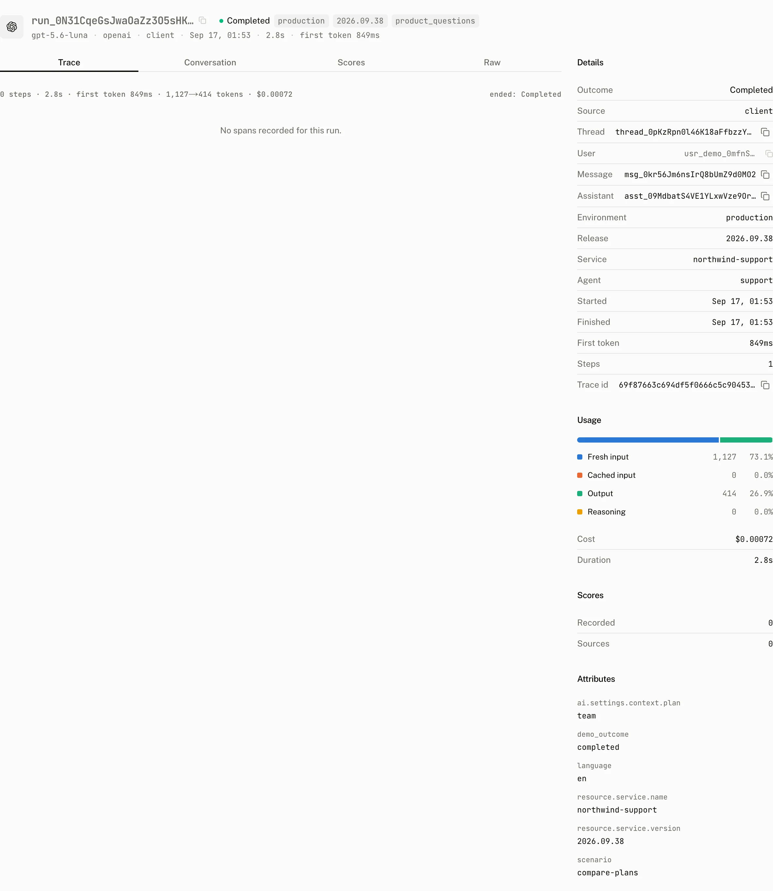

The browser knows when a response started, reached its first token, and settled. The server knows the model steps, tool work, and usage inside that response. Assistant Cloud accepts OpenTelemetry spans from the server and joins them with the browser run report when both carry the same trace id.

Server spans also stand on their own. A trace can create a run, price its model work, and appear in Runs and Models even when no browser report exists.

## Set up the AI SDK exporter

<Steps>
<Step>

### Install the OpenTelemetry packages

```sh
npm i assistant-cloud @vercel/otel @ai-sdk/otel @opentelemetry/api @opentelemetry/sdk-trace-base @opentelemetry/exporter-trace-otlp-http
```

`assistant-cloud/telemetry` keeps the OpenTelemetry packages as optional peers, so importing the main `assistant-cloud` entry does not require them.

</Step>
<Step>

### Export spans at startup

In Next.js, register the span processor in `instrumentation.ts` so it starts once per server process. Keep the project API key on the server.

```ts title="instrumentation.ts"
import { registerOTel } from "@vercel/otel";
import {
  createAssistantCloudSpanProcessor,
  createAssistantCloudTraceExporter,
} from "assistant-cloud/telemetry";

export function register() {
  registerOTel({
    serviceName: "my-app",
    spanProcessors: [
      "auto",
      createAssistantCloudSpanProcessor(
        createAssistantCloudTraceExporter({
          apiKey: process.env.ASSISTANT_API_KEY!,
        }),
      ),
    ],
  });
}
```

`createAssistantCloudTraceExporter()` accepts `{ apiKey, baseUrl?, headers? }`. `apiKey` is required. `baseUrl` defaults to `https://backend.assistant-api.com`, trailing slashes are removed, and the exporter posts to `/v1/traces` with `Authorization: Bearer <apiKey>` merged with any extra headers.

`createAssistantCloudSpanProcessor(exporter, { filter? })` wraps a batch span processor. It forwards every start, but forwards an ended span only when the filter accepts it. Its default is `isAssistantCloudSpan`: a span whose `gen_ai.operation.name` is a string, or whose name starts with `gen_ai.`, `ai.`, or `llm.`. Pass `filter` to use a narrower or broader selection.

</Step>
<Step>

### Carry the trace id to the browser

Enable the AI SDK's OpenTelemetry integration and attach the trace id to the stream's message metadata:

```ts title="app/api/chat/route.ts"
import { OpenTelemetry } from "@ai-sdk/otel";
import { openai } from "@ai-sdk/openai";
import { convertToModelMessages, streamText } from "ai";
import { withAssistantCloudTraceMetadata } from "assistant-cloud/telemetry";

export async function POST(request: Request) {
  const { messages } = await request.json();
  const result = streamText({
    model: openai("gpt-5.6-luna"),
    messages: await convertToModelMessages(messages),
    telemetry: { integrations: [new OpenTelemetry()] },
  });

  return result.toUIMessageStreamResponse({
    messageMetadata: withAssistantCloudTraceMetadata(),
  });
}
```

`assistantCloudTraceMetadata()` reads the active span context and returns `{ traceId }` only for a valid context. `withAssistantCloudTraceMetadata(messageMetadata?)` preserves your callback and merges that value only into the stream's `start` part. The browser then reads `traceId` from the persisted message and sends it as `trace_id` in its [run report](/docs/cloud/run-reports).

</Step>
</Steps>

## The trace receiver

`POST /v1/traces` is an OTLP over HTTP receiver. It requires a project API key. A request with a browser token returns `{ "error": "This endpoint requires an API key" }`; a missing authorization header returns `401`.

| Request part | Accepted value | Refusal |
|---|---|---|
| `Content-Type` | `application/json`, `application/x-protobuf`, or `application/protobuf` | `415 { "error": "Send application/json or application/x-protobuf" }` for every other type. |
| `Content-Encoding` | `identity`, `gzip`, or `deflate` | `415 { "error": "Unsupported content encoding <encoding>" }` for every other encoding. |
| Body size | At most 4,194,304 bytes, or 4 MB | `413 { "error": "Export exceeds the 4 MB limit" }` when the declared or streamed body is larger. |
| Body syntax | A decodable OTLP JSON or protobuf export | `400 { "error": "<parser message>" }` when decoding fails. |

An all accepted export returns `{}`. An export with rejected spans still returns `200` and identifies the partial success:

```json title="Partial success response"
{
  "partialSuccess": {
    "rejectedSpans": 2,
    "errorMessage": "<joined receiver errors>"
  }
}
```

When the receiver has no individual error text, `errorMessage` is `"<n> spans were rejected"`. Use this response rather than assuming that `200` means every span became a run.

## How spans become runs

The receiver recognizes a span when `gen_ai.operation.name`, or the first word of its name, is `chat`, `text_completion`, `embeddings`, `execute_tool`, `invoke_agent`, or `create_agent`. All other spans are rejected. A trace can contain at most 500 accepted spans; each later span is rejected with `Trace <trace id> exceeds the 500 span limit` in `partialSuccess`.

| Span relationship | Result |
|---|---|
| A recognized GenAI span with no recognized GenAI ancestor | A run root. A trace is one run: a second root in the same trace joins that run, and the run's start, duration and step count cover every span of the trace, whichever export batch brought them. |
| An `invoke_agent` root | The run itself, not a step of an outer run. |
| `chat`, `text_completion`, or `embeddings` under a root | A model step of the root run. |
| `execute_tool` under a model step | A tool call attached to that step. |
| `execute_tool` directly under a root | A tool call attached to the step that finished most recently before the tool began. |
| A chat span under a tool span | A sampling call for that tool, representing its nested model request. |

### Attributes the receiver reads

The receiver reads these OpenTelemetry resource and span attributes. Unmapped attributes are retained on the span and run instead of being discarded.

| Attribute | Destination |
|---|---|
| `gen_ai.operation.name` | Decides whether the span is a recognized GenAI span and what role it has. |
| `gen_ai.response.model`, then `gen_ai.request.model` | The model. The response value has precedence. |
| `gen_ai.provider.name`, then `gen_ai.system` | The provider. When both are absent, the receiver resolves a provider from the model when it can. |
| `gen_ai.usage.input_tokens` | Input tokens. |
| `gen_ai.usage.cache_read.input_tokens` | Cached input tokens. |
| `gen_ai.usage.output_tokens` | Output tokens. |
| `gen_ai.usage.reasoning.output_tokens` | Reasoning tokens. |
| `gen_ai.response.finish_reasons` | The first finish reason. `length`, `content_filter`, and `content-filter` make a run incomplete. |
| `gen_ai.response.time_to_first_chunk` | First token time. A numeric value is seconds and becomes rounded milliseconds. |
| `gen_ai.tool.name`, `gen_ai.tool.call.id`, `gen_ai.tool.call.arguments`, and `gen_ai.tool.call.result` | A tool span's name, call id, arguments, and result. |
| `gen_ai.input.messages` and `gen_ai.output.messages` | A model span's input and output. |
| `gen_ai.conversation.id` | The cloud thread id. The receiver links it only when that thread exists in the project. |
| `gen_ai.agent.name` | The root agent name. |
| `error.type` | The run error code and span error type. An error root status also records the status message as the run error. |
| `user.id` or `enduser.id` | The end user on the run. |
| `service.name` | The run service. |
| `service.version` | The run release. |
| `deployment.environment.name`, then `deployment.environment` | The run environment. |

An error status on a root span makes the run an error. If `gen_ai.conversation.id` does not name a project thread, the receiver keeps the submitted id in `attributes["gen_ai.conversation.id"]` instead of linking the run. Every OTLP created run also carries `attributes["telemetry.source"] = "otlp"`.

Run and span attributes are each capped at 16,384 bytes. When they exceed that cap, the receiver drops the largest entries first and adds `truncated: true`. This cap is independent of the 500 span trace cap.

### Stable ids and reexports

A trace root's id is deterministic: `run_<first 24 hexadecimal characters of sha256(projectId + traceId + rootSpanId)>`. Exporting the same root again updates that run instead of creating a second run. Each span is also upserted by its trace id and span id, so the new export replaces its stored span fields.

| Value from a client report | What a later trace export keeps |
|---|---|
| `source`, `created_by`, and `created_at` | The client owned value. |
| `thread_id`, `assistant_id`, and `message_id` | The client owned value. |
| `tags`, `environment`, `release`, and `first_token_ms` | The client owned value. |
| `aborted` or `disconnected` outcome | The client owned outcome. |
| Any attribute beginning `client.` | The client owned value. |

The receiver negates and reapplies the affected daily rollup after an update, so a reexport changes aggregates rather than adding a duplicate.

## Merge a server trace with a client report

The report and trace must have the same valid W3C trace id in one project. Either order works.

| Field family | Trace receiver | Client report |
|---|---|---|
| Model, provider, usage, duration, steps, and span tree | Authoritative | Kept only as client report input, not used to replace server trace data. |
| `message_id` and `tags` | Preserved when the client report supplied them | May write them. |
| `outcome_type` | Keeps trace behavior | May write only `aborted` or `disconnected`. |
| Thread and user | Uses span attributes when present | May fill a missing thread or unknown telemetry user. |
| Environment and release | Uses span resource attributes when present | May fill a missing value. |
| First token time | Keeps a server value when present | May fill a missing server value and is always stored as `client.first_token_ms`. |

The result is one run with a trace waterfall. Open it from the Runs page to inspect the model steps, tools, sampling calls, timing, usage, and the selected span's arguments or prompt.



## Track sub agent model work

A tool that calls another model is a sampling call. With server tracing enabled, a chat span nested under a tool span is attached automatically. Without server tracing, collect calls while the tool runs and send them through message metadata.

```ts title="app/api/chat/route.ts"
import { convertToModelMessages, streamText, tool } from "ai";
import { openai } from "@ai-sdk/openai";
import { z } from "zod";
import {
  createSamplingCollector,
  type SamplingCallData,
} from "assistant-cloud";

export async function POST(req: Request) {
  const { messages } = await req.json();
  const samplingCalls: Record<string, SamplingCallData[]> = {};

  const result = streamText({
    model: openai("gpt-5.6-luna"),
    messages: await convertToModelMessages(messages),
    tools: {
      delegate: tool({
        inputSchema: z.object({ task: z.string() }),
        execute: async ({ task }, { toolCallId }) => {
          const collector = createSamplingCollector();
          const answer = await runSubAgent(task, {
            onSamplingCall: collector.collect,
          });
          samplingCalls[toolCallId] = collector.getCalls();
          return answer;
        },
      }),
    },
  });

  return result.toUIMessageStreamResponse({
    messageMetadata: ({ part }) => {
      if (part.type === "finish") {
        return { usage: part.totalUsage, samplingCalls };
      }
      return undefined;
    },
  });
}
```

`SamplingCallData` accepts optional `model_id`, `input_tokens`, `output_tokens`, `reasoning_tokens`, `cached_input_tokens`, and `duration_ms`. The AI SDK extractor uses `samplingCalls[toolCallId]` for the matching tool call. For an MCP sampling handler, wrap it with `wrapSamplingHandler(handler, collector.collect)`. The wrapper measures duration, reads current and legacy usage names, resolves the model from the response or model preference hint, and does not let a failing collection callback break the sampling request.

## Connect an external trace viewer

**Settings › Telemetry** accepts an optional trace link template of up to 512 characters. Leave it empty, or include the literal `{trace_id}`, for example `https://cloud.langfuse.com/project/abc/traces/{trace_id}`. The dashboard substitutes the trace id in the run detail view. A template without `{trace_id}` cannot be saved.

## The docs chat as a working pattern

The documentation chat registers a service named `assistant-ui-docs`. When a project API key is available, it creates the Assistant Cloud exporter with that key and an optional backend URL, then includes an Assistant Cloud span processor alongside the automatic processor and its other telemetry exporters. It uses a local AI span filter rather than the package default.

Its chat route wraps its existing metadata callback with `withAssistantCloudTraceMetadata`. It returns `modelId` when a step finishes and `usage` when the response finishes. That pair supplies the browser report, while the exporter supplies the server span tree.

## Configure another producer

Any OpenTelemetry producer can export to the receiver. Send its OTLP HTTP export to `https://backend.assistant-api.com/v1/traces` with the project API key, emit recognized GenAI spans, and add `gen_ai.conversation.id` when the work belongs to a cloud thread.

```yaml title="otel-collector.yaml"
exporters:
  otlphttp/assistant-cloud:
    endpoint: https://backend.assistant-api.com
    headers:
      Authorization: "Bearer ${env:ASSISTANT_API_KEY}"
```

The collector configuration supplies the exporter destination and credentials. The producer still needs the recognized operation, model, provider, usage, thread, user, and deployment attributes described above.

## Troubleshooting

| What you see | Why | What to do |
|---|---|---|
| `partialSuccess` reports rejected spans | The span has no recognized operation, uses a different operation name, or exceeds the trace's 500 span cap. | Emit one of the six recognized GenAI operations and keep each trace to 500 spans or fewer. |
| `413` from the receiver | The compressed or uncompressed request body exceeded 4 MB while declared or streamed. | Send a smaller OTLP export. |
| `415` from the receiver | The content type or content encoding is not accepted. | Use OTLP JSON, `application/x-protobuf`, or `application/protobuf`, with `identity`, `gzip`, or `deflate` encoding. |
| `400` from the receiver | The OTLP body could not be decoded. | Read the parser message returned in `{ "error": "<parser message>" }` and fix the payload. |
| A run has no thread | `gen_ai.conversation.id` was absent or did not identify a thread in this project. | Export the cloud thread id as `gen_ai.conversation.id`. |
| One request appears as two runs | The server work ran under two trace ids, or the browser report carries a different trace id from the server spans. | Keep one trace per request and carry the same active trace id into the browser metadata. |
| Tokens or a price are missing | The spans did not provide usage or model and provider values, or the browser route did not return `messageMetadata`. | Emit the GenAI usage, model, and provider attributes, and return model, provider, and usage from the route. |
| Reexporting a trace changes no client fields | Client owned fields and `client.` attributes survive trace reexports. | Send a new client report when those values should change. |
