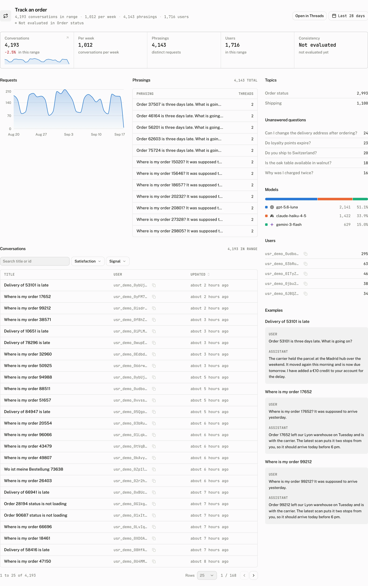
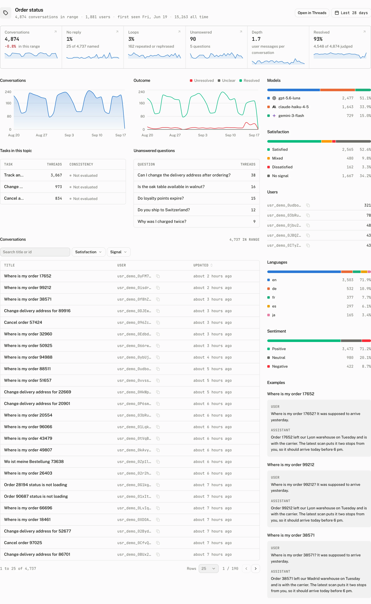

Intelligence turns analysed conversations into a view of what people ask for and where the assistant falls short. It is a reading page: choose the range, inspect the evidence, then follow any figure into the matching [Threads](/docs/cloud/dashboard/threads) list. Configure the worker, provider, and classifier rules in [Intelligence settings](/docs/cloud/intelligence).

## What the page answers

The page opens on the last 28 days. Its header identifies the conversations covered by that range and the most recent analysis run, so compare a figure only with the coverage shown beside it. The date range stays with every drilldown.

### The six tiles

| Tile | What it counts |
|---|---|
| **Analysed** | Conversations the analysis passes processed in the selected range, junk included. |
| **Junk** | The share of the conversations the pass scanned that it stored as junk and left out of model classification, with their count. |
| **No reply** | Named conversations with no assistant messages. |
| **Loops** | Named conversations with an exact repeat or a rephrased turn. |
| **Unanswered** | Conversations with an unanswered question. |
| **Resolved** | Conversations whose analysis records a resolved outcome. |

**Conversations by topic** puts the analysed conversation count into the selected date buckets by topic. **Signals** puts the no reply, loop, unanswered, sentiment, resolution, and depth readings into those buckets, so a change can be located before opening the rows behind it.

### Reading the Topics pivot

The **Topics** table is the compact comparison of the named conversation groups. Open a topic to read that topic over the active range.

| Column | Reading |
|---|---|
| **Threads** | The conversations assigned to the topic. |
| **Share** | The share reading for the topic. |
| **Trend** | The topic's trend reading, when the table has one. |
| **No reply** | Named conversations in the topic with no assistant messages. |
| **Loops** | Conversations in the topic with an exact repeat or a rephrased turn. |
| **Unanswered** | Conversations in the topic with an unanswered question. |
| **Depth** | The mean number of user messages in the topic's conversations. |
| **Users** | The Users reading for the topic. |
| **Resolved** | The Resolved reading for the topic. |
| **Thumbs down rate** | Opens Threads with `topic` set and `feedback=negative`. |

A rate that stands out from the page's own mean is shown in its outcome's color, so the row that needs attention is found without a flag column. A blank Trend cell has no trend reading.

### Tasks, questions, and judged outcomes

**Tasks** groups repeated requests. Its consistency reading is **Consistent**, **Mixed**, or **Inconsistent**. Open a task to inspect it in the current range. The **Tasks** table carries a **Thumbs down rate** that opens Threads with `task` set and `feedback=negative`.

**Unanswered questions** lists the questions identified by the classifier, with the selected range still in effect. **Sentiment by topic** compares the topic groups, while the judged mix below it separates **Sentiment**, **Resolution**, and **Languages**. Sentiment is positive, neutral, or negative. Resolution separates resolved and unresolved conversations. Languages is the language mix reported by analysis.

**Evaluator verdicts** shows the evaluator results alongside the analysis. Any judged section that has not received a result reads **Not judged yet** and explains **After the next analysis run.**

## Follow a figure to the conversations

Every Intelligence figure is a route into Threads. The link keeps the page's date range and adds the matching filter, which makes the table the evidence behind the count.

| Figure or detail | Threads filter |
|---|---|
| Topic or topic page | `topic` |
| Task or task page | `task` |
| Unanswered question | `question` |
| Junk | `junk` |
| Sentiment | `sentiment` |
| Resolution | `resolved` |
| Language | `language` |
| No reply | `signal=no_reply` |
| Loops | `signal=loop` |
| Thumbs down rate in Topics or Tasks | The matching `topic` or `task`, and `feedback=negative` |

Threads can combine these with the other filters in its bar. In particular, **Ended on the user's message** is the separate `unanswered` filter; it is not the same reading as the analysis's unanswered question signal.

## Detail pages and runs

Opening a topic uses the active date range to show that topic's reading and its related Threads. Opening a task does the same for the task, its consistency and its skill.

### What went wrong

**What went wrong** lists the comments end users left on a thumbs down and the notes reviewers left on reviews marked **Needs work**.

### Skill

The analysis drafts a skill name, a one sentence description of when to use it and instructions by reading the conversations and those complaints. A person can edit the draft and press **Publish**. No LLM provider or assistant is needed to publish.

**Update** saves later edits. **Unpublish** withdraws the published skill. A newer draft never replaces published text. The page offers **Load draft** instead. A backend reads published skills through [`GET /v1/projects/skills`](/docs/cloud/api/project#list-project-skills). **Create assistant** remains a secondary action.

**Analysis runs** is the ledger for the work behind the page. The summary retains the latest 3 runs and their aggregate run count, failed count, cost, and tokens. **All runs** opens the runs page, which paginates the analysis-run ledger 50 records at a time. A run row records the day, scanned conversations, junk count, model, and either its cost or status. The settings page's **Run now** and **Re-analyse last 28 days** controls queue this work; the worker passes every hour and takes queued requests first.

## When the page has no answer yet

Intelligence is available on paid plans. Without it, the page reads: **Intelligence requires a paid plan. Upgrade on the Billing page to unlock topic analysis for this project.**

Before the first completed analysis, the page reads: **No analysis yet. The analysis runs every hour on the provider chosen in Settings; its topics, tasks and signals appear here after the first run.**

## Troubleshooting

| What you see | Why | What to do |
|---|---|---|
| A topic is missing | The conversation may be classified as junk, or the configured topic ceiling folded new conversations into Other. | Check the conversation in Threads with the Junk filter, then review the classifier settings. |
| A topic has no trend | The table has no Trend reading for that topic. | Compare the topic after later analysis runs. |
| Evaluator verdicts are empty | The section has not been judged yet. | Read the **After the next analysis run** state, then inspect the analysis-run ledger. |
