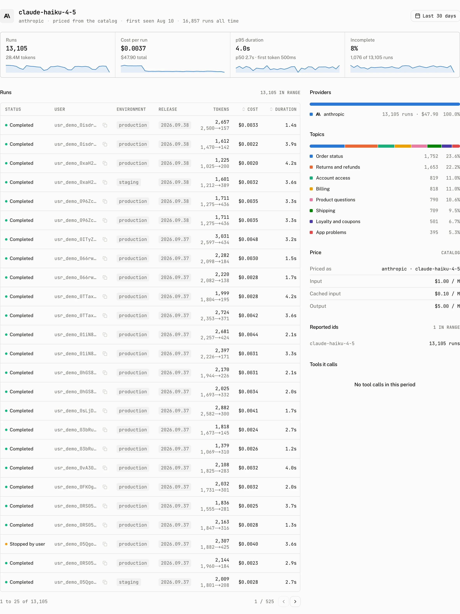

Models turns run telemetry into a comparison of the models your application used. It groups the same catalog model and provider together, then lets you inspect the runs, reported ids, price, topics, and tools behind one row.

## What the page answers


Each top level row represents one model and provider pair. The dashboard groups reported spellings that resolve to the same catalog id under that pair. Open the row to see its reported ids as subrows, so a provider specific spelling does not split the aggregate from the catalog model it identifies.

| Row or state | Reading |
| --- | --- |
| Model and provider | The canonical catalog model id and the provider that reported the run. |
| Reported id subrow | One reported model id folded into the canonical model row. |
| **No model reported** | Runs that carry no model id. This is separate from a known but unpriced model. |
| Unpriced | The run named a model, but the dashboard has no recorded price for it. |

When the range has runs but none named a model, the page says: “No run in this period reported a model. The dashboard names a model only when the client sends its id. Return it from the `messageMetadata` callback of your AI SDK route; runs that go through an assistant on the server carry it already.”

The fix is on the route, not in the dashboard. The browser stream carries no model or usage, so the route returns them in the message metadata the runtime stores and reports. Every run reported after the deploy names its model:

```ts title="app/api/chat/route.ts"
return result.toUIMessageStreamResponse({
  messageMetadata: ({ part }) => {
    if (part.type === "finish") {
      return { usage: part.totalUsage, finishReason: part.finishReason };
    }
    if (part.type === "finish-step") {
      return { modelId: part.response.modelId, provider: model.provider };
    }
    return undefined;
  },
});
```

[Run reports](/docs/cloud/run-reports#messagemetadata-values) lists every key the callback can return.

An unpriced result means the catalog did not resolve a price and no matching [model price override](/docs/cloud/settings/model-prices) supplied one. A reported `cost_usd` or cost details take precedence over catalog pricing, so a row can have a cost even when its catalog price is absent.

### Tiles and charts

The tiles summarise the selected range, and the charts show how the row values changed across it.

| Figure | What it shows |
| --- | --- |
| Cost | Cost attributed to the models in the range. |
| Cost per run | Model cost compared with the number of runs. |
| Cached input | The cached portion of model input. |
| p95 duration | The duration under which 95 percent of model runs finished. |
| Cost by model | Cost broken down by model. |
| Outcome by model | Run outcomes for each model. |
| Latency by model | Model latency over the range. |
| Cost per run vs previous period | The current cost per run compared with the preceding range of equal length. |
| Incomplete over time | Incomplete runs across the range. |

The run counts, outcomes, and latency percentiles read the `runs` table. Time series use the daily rollup. Sampling usage is read from that rollup or from span rows, so its tokens and cost are attributed to the sampled model without increasing the run count. A sampling call is usage inside a tool call, not a new run.

### Sampling calls

A sampling call can report its own model id, input, cached input, output, reasoning tokens, duration, and cost. Its tokens and cost belong to the sampled model. The Models page therefore shows the usage that a tool's sampled model incurred, while the Runs figure remains the number of runs rather than the number of sampling calls.

## Inspect one model



Select a model row to open its detail page. Its range is the dashboard range, except that `?user=` scopes every figure and section to one end user. The page shows that user in a badge and offers **Show all users** to remove the scope.

| Part | What it contains |
| --- | --- |
| Tiles | Runs, Cost per run, p95 duration, and Incomplete for the model and provider pair. |
| Runs | The filtered run table for the selected model. |
| Providers | The providers that reported the model. |
| Price | **Priced as**, **Input**, **Cached input**, and **Output** rows explaining the resolved price. |
| Reported ids | The ids that were folded into the catalog model. |
| Topics | Topics associated with the model's runs. |
| Tools it calls | Tools recorded by the model's runs. |

The Price rows are the quickest way to see whether a catalog entry or a project price override supplied the calculation. If the page is scoped with `?user=`, that scope applies to the tiles, runs, providers, price, reported ids, topics, and tools together.

## Troubleshooting

| What you see | Why | What to do |
| --- | --- | --- |
| A model appears twice | The runs belong to different model and provider pairs, or a reported id does not fold into the same catalog id. | Open the rows and compare their provider and **Reported ids** values. |
| A model reads Unpriced | The id has no catalog price and no matching project price override. | Add a [model price override](/docs/cloud/settings/model-prices) for the id and provider, then check the Price rows. |
| A model is missing after a provider change | A model row is paired with its provider. Runs reported through the new provider form a separate pair. | Inspect the range for the new provider pair and compare its reported ids with the previous row. |
| The cost does not match the provider invoice | The dashboard uses a caller supplied cost when present. Otherwise it resolves the catalog price or a matching project override from reported usage. | Compare the model id, provider, usage, and Price rows. Add or correct a [model price override](/docs/cloud/settings/model-prices) when the catalog price is not the rate you use. |
