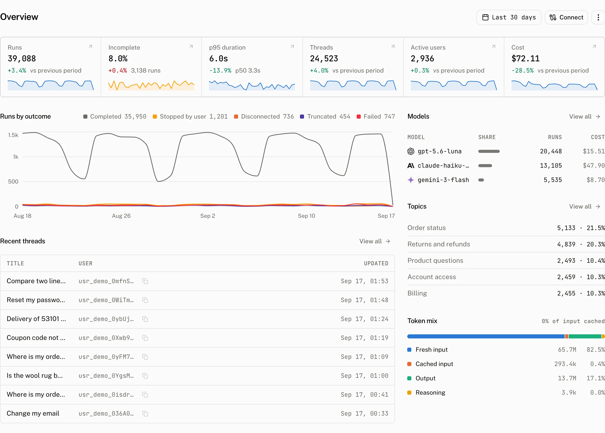

Overview is the dashboard's range summary. It answers how much the assistant ran, how reliably it finished, who used it and what it cost before you open a filtered list.

## What the page measures

The date picker starts at 30 days. The eight tiles appear in two rows: **Runs**, **Incomplete**, **p95 duration** and **Cost**, then **Threads**, **Active users**, **Rated threads** and **Thumbs down**. Every tile compares its current reading with the immediately preceding range of equal length, and its sparkline shows the reading across the selected range. Open a tile to investigate the matching list or billing view.

| Tile | Reading for the selected range | Comparison and sparkline | Opens |
|---|---|---|---|
| **Runs** | Total runs. | The total against the previous range, with runs in each bucket. | [Runs](/docs/cloud/dashboard/runs) |
| **Incomplete** | The incomplete rate and the number of incomplete runs. | The rate against the previous range, with the share of incomplete runs in each bucket. | [Runs](/docs/cloud/dashboard/runs), filtered to incomplete |
| **p95 duration** | The duration under which 95 percent of runs finished. The tile also prints p50. | The p95 against the previous range, with daily p95 duration. | [Runs](/docs/cloud/dashboard/runs) |
| **Cost** | Total run cost. | The total against the previous range, with cost in each bucket. | [Billing usage](/docs/cloud/settings/billing) |
| **Threads** | Threads with activity in the range. | The total against the previous range, with threads in each bucket. | [Threads](/docs/cloud/dashboard/threads) |
| **Active users** | Distinct active users. | The total against the previous range, with active users in each bucket. | [Users](/docs/cloud/dashboard/users) |
| **Rated threads** | Threads with a rating. | The total against the previous range, with rated threads in each bucket. | [Threads](/docs/cloud/dashboard/threads), with **Feedback** set to **Any rating** |
| **Thumbs down** | Threads with a thumbs down rating. | The total against the previous range, with thumbs down in each bucket. | [Threads](/docs/cloud/dashboard/threads), with **Feedback** set to **Thumbs down** |

The **Token mix** block separates input, cached input, output and reasoning tokens for the selected range.

## Read outcomes and configuration changes

**Runs by outcome** draws one series per bucket. A completed status goes to **Completed**. Every other bucket is decided by `outcome_type`.

| Chart bucket | Stored value |
|---|---|
| **Completed** | `status: "completed"` |
| **Stopped by user** | `outcome_type: "aborted"` |
| **Disconnected** | `outcome_type: "disconnected"` |
| **Truncated** | `outcome_type: "length"` or `"content_filter"` |
| **Failed** | Any other nonempty `outcome_type` |
| **Unknown** | No `outcome_type` |

The chart also puts configuration marks in the bucket that contains the recorded change. Marks come only from audit entries for `feature`, `project`, `provider` and `model_price`. Their summaries include `Thread titles: turned on, model set to gpt-…`, `Retention to 30 days, pending`, `Retention change cancelled`, `Provider {name} added`, `Harness {name} updated` and `Model price for {pattern} set`.

## Find the next conversation

**Get started** is a checklist over three resources, LLM providers, assistants and API keys, with a **Connect** link to set up each one.

**Recent threads** lists the 8 most recently active threads, ordered by `last_message_at`, with each creator's display name. The **Topics** tile shows the topics [Intelligence](/docs/cloud/intelligence) found, and the model list is the range's share of runs by model.

## Troubleshooting

| What you see | Why | What to do |
|---|---|---|
| The page has no figures. | The selected range has no stored activity to summarise. | Choose a range that contains runs or conversations, then check the matching list page. |
| Cost is `0` while runs are present. | A run can have no recorded `cost_usd`, including when its model has no catalog price or matching price override. | Inspect the model on the run, then add a matching price override in [Model prices](/docs/cloud/settings/model-prices) or send cost with the report. |
| A configuration mark does not describe the change you expected. | The chart accepts marks only for `feature`, `project`, `provider` and `model_price`, and renders its own short audit summary. | Compare the change in [Audit log](/docs/cloud/settings/audit-log) and its timestamp with the selected chart bucket. |
