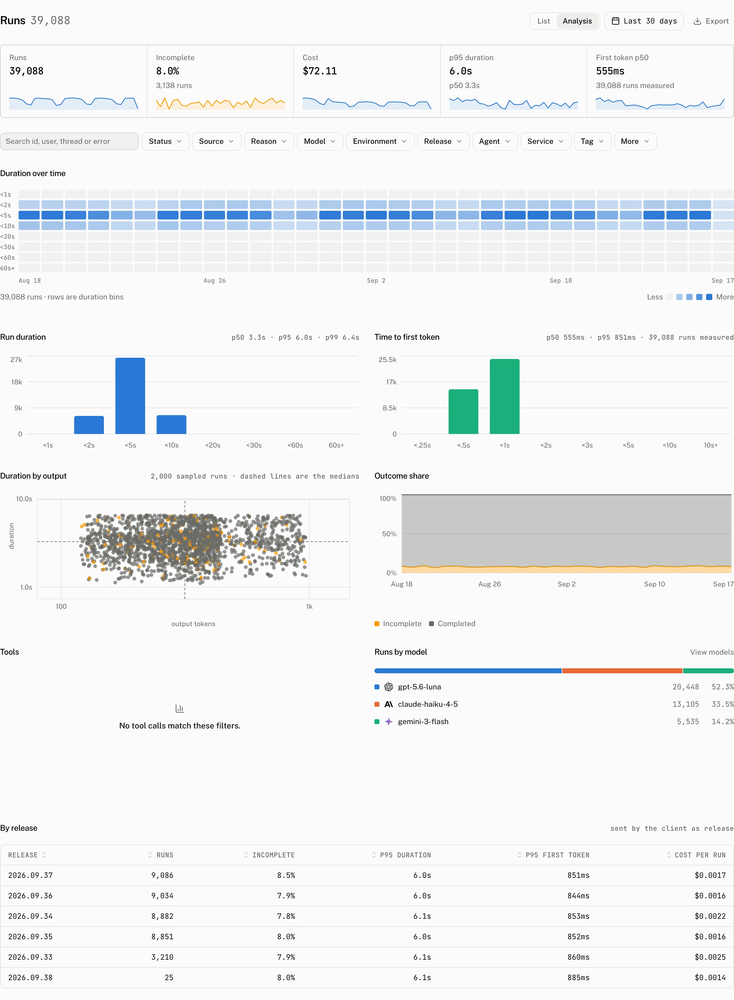

Runs is the response and trace explorer. Use List to find one report and Analysis to compare the filtered population, then open a run to inspect its timings, usage, attributes, scores and spans.


## Read the range summary

The page shows five tiles for the selected range. **Runs** is the total. **Incomplete** shows the incomplete rate and count. **Cost** is the total cost. **p95 duration** also prints p50. **First token p50** reports p50 time to first token and captions the result with the number of runs measured. The volume strip plots runs for each time bucket; select a bucket to narrow the page to it.

Runs the cloud made on its own behalf, such as title generation, have the source `system`. They are left out of the tiles and charts, and the **Source** facet can still list them.

## Find a run in List

List is the default view. Search matches a run id, thread id, user id, error message or error code. The sorts are **Created**, **Cost** and **Duration**, with **Created**, newest first, as the default.

| Facet | Values or input |
|---|---|
| **Status** | `completed`, `incomplete` or `error`. |
| **Source** | `client`, `server` or `system`. |
| **Reason** | `rate_limited`, `validation_failed`, `provider_error`, `server_error`, `budget_denied`, `persistence_error`, `aborted`, `timeout`, `disconnected`, `length` or `content_filter`. |
| **Model** | The reported model ids in the range. |
| **Environment** | The reported deployment environments in the range. |
| **Release** | The reported application releases in the range. |
| **Agent** | The reported agent names in the range. |
| **Service** | The reported service names in the range. |
| **Tag** | A reported run tag. |
| **Cost** | Minimum and maximum cost inputs. |
| **Duration** | Minimum and maximum duration inputs. |

The table columns are **Status**, **Model**, **User**, **Environment**, **Release**, **Tokens**, **Cost**, **Duration** and **Created**. The page requests 50 rows by default.

## Compare runs in Analysis

Select **Analysis** to apply the same filters to distribution and comparison views.



| Section | What it shows |
|---|---|
| Latency percentiles | p50, p95 and p99 for duration and the first token percentiles. |
| Run duration | A histogram with `<1s`, `<2s`, `<5s`, `<10s`, `<20s`, `<30s`, `<60s` and `60s+` bins. |
| Time to first token | A histogram with `<.25s`, `<.5s`, `<1s`, `<2s`, `<3s`, `<5s`, `<10s` and `10s+` bins. |
| Duration over time | A time bucket by duration bin heatmap. |
| Duration by output | A scatter sample of 2,000 runs. |
| Outcome share | The outcome buckets over time. |
| Tools | Tool call aggregates from matching spans. |
| By release | **Release**, **Runs**, **Incomplete**, **p95 duration**, **p95 first token** and **Cost per run**. |
| Runs by model | Per model and provider aggregates. |

The outcome buckets are the ones the [Overview chart](/docs/cloud/dashboard/overview#read-outcomes-and-configuration-changes) draws.

## Inspect one run

Open a row to reach the run page. Its **Details** rail has **Outcome**, **Source**, **Thread**, **User**, **Message**, **Assistant**, **Environment**, **Release**, **Service**, **Agent**, **Started**, **Finished**, **First token**, **Steps** and **Trace id**. Thread and trace ids are copyable, and the thread id links to its conversation when the run has one.

**Usage** lists the token rows, **Cost** and **Duration**. **Attributes** is the run's attributes ledger. **Scores** shows **Recorded** and **Sources**.

The trace waterfall gives every stored span a row. Select a span to open its rail, which shows **Kind**, **Tool**, **Source**, **Model**, **Step**, **Finish reason**, **Tool call id**, **Offset**, **Duration**, **Status**, **Status code**, **Error type**, **Started**, **Ended**, **Input tokens**, **Output tokens** and **Cost**. A null span cost reads *Not priced*. The rail also renders **Arguments** and **Prompt** from the span's recorded input and output.

Set a **Trace link template** in [Settings › Telemetry](/docs/cloud/settings/telemetry) with `{trace_id}` where the trace id belongs. A run with a trace id makes its **Trace id** row an external link using that template.

## Troubleshooting

| What you see | Why | What to do |
|---|---|---|
| A run is under *No model reported*. | The report carried no model id. The browser cannot see which model answered unless the route tells it. | Return the model id from the `messageMetadata` callback in an AI SDK route; see [Run reports](/docs/cloud/run-reports). Runs executed by a server assistant already carry it. |
| A run has no thread. | The run came from an exported trace whose `gen_ai.conversation.id` did not resolve to a thread, or from a report without a thread. | Set `gen_ai.conversation.id` to the cloud thread id on the server span, or send `thread_id` in the report; see [Traces](/docs/cloud/traces). |
| A run has no spans. | A report can omit `steps`, and the trace view has no stored spans to draw. | Send the report's steps or export the server trace for that response. |
| Cost reads *Unpriced*. | The run has no recorded `cost_usd` and its model has no matching catalog price or project price override. | Add a matching price override in [Model prices](/docs/cloud/settings/model-prices), or include cost in the run report. |

The *No model reported* row is fixed on the route, not in the dashboard. The browser stream carries no model or usage, so the route returns them in the message metadata the runtime stores and reports:

```ts title="app/api/chat/route.ts"
return result.toUIMessageStreamResponse({
  messageMetadata: ({ part }) => {
    if (part.type === "finish") {
      return { usage: part.totalUsage, finishReason: part.finishReason };
    }
    if (part.type === "finish-step") {
      return { modelId: part.response.modelId, provider: model.provider };
    }
    return undefined;
  },
});
```

[Run reports](/docs/cloud/run-reports#messagemetadata-values) lists every key the callback can return.
