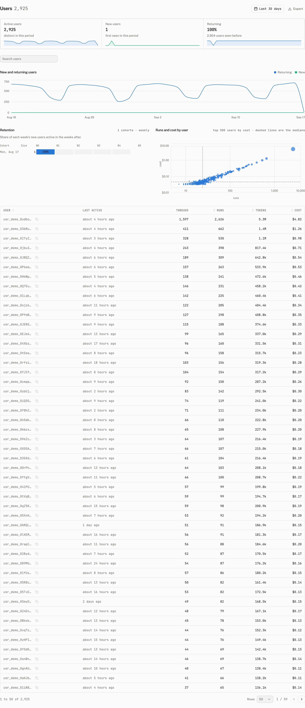
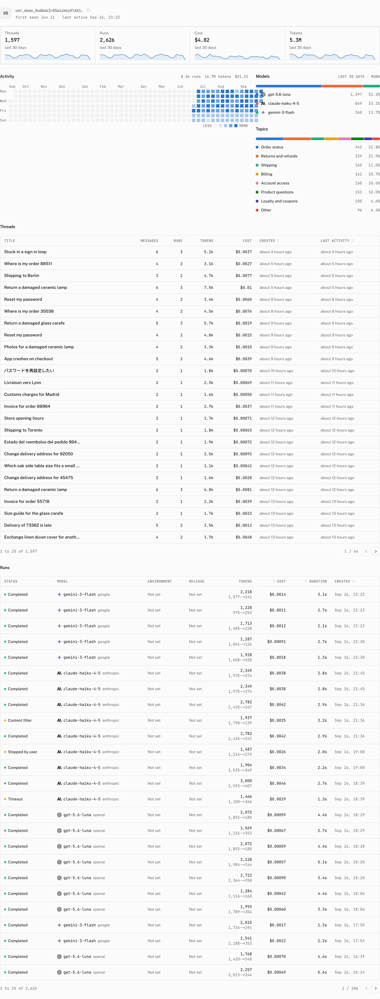

Users shows the people behind the selected range, from their first activity through the conversations and model usage they generated. It is the place to compare adoption and retention without reducing a person to a run count.

## What the page answers

The tiles count people over the selected range.

| Tile | What it counts |
| --- | --- |
| Active users | Users with activity in the range. |
| New users | Users whose first activity is in the range. |
| Returning | Users active in the range who had been seen before it. |

The table supplies the people behind those totals.

| Column | Reading |
| --- | --- |
| User | The display name when the identity supplied the Name claim, otherwise the user id. |
| Runs | Runs attributed to the user in the range. |
| Tokens | Tokens attributed to those runs. |
| Cost | Cost attributed to those runs. |

Every column sorts. The page opens sorted by Runs and shows 50 people per page, with 25 and 100 as the other page sizes. Search matches user ids and display names.

### Charts

| Chart | What it shows |
| --- | --- |
| New and returning users | New and returning users for each day in the range. |
| Retention | “Share of each week's new users active in the weeks after.” |
| Runs and cost by user | A comparison of each user's runs and cost. The chart samples 500 users by default, with a minimum of 50 and a maximum of 2,000. |

The Name claim is recorded as the project's display name for that user. A missing claim does not suppress the user. The dashboard shows the id instead, and searches it as well.

## Inspect one user

Select a user to open their page. This page always reads a fixed last 30 days, including its Threads and Runs sections. The dashboard range picker does not change that window, so use the list page when you need a different historical range.

| Part | What it contains |
| --- | --- |
| Tiles | Threads, Runs, Cost, and Tokens from the fixed 30 day window. |
| Models | The model distribution for the user, captioned “Last 30 days · runs”. It reads “No runs in the last 30 days” when there are none. |
| Topics | Topics associated with the user's activity. |
| Threads | The user's threads in the fixed window. |
| Runs | The user's runs in the fixed window. |
| Activity | First seen and last active timestamps for the user. |

The user page reads “User not found” when there is no usage for that id.

### Page users and billed active users

The Users page applies its selected range to its people and charts. Billing uses a different definition: an active user is an end user who sends at least one message in a UTC calendar month. The plan counts that end user once for the month, whatever range the dashboard is showing. A user can therefore appear in a page range without changing the current billing period, or count in the billing period even when the selected range excludes their message.

There is no delete control on the Users page. User erasure is available through the project user API only, using API key authentication.

## Troubleshooting

| What you see | Why | What to do |
| --- | --- | --- |
| A user is counted on Billing but is absent here | Billing counts one end user per UTC calendar month. The Users page is limited to the selected range. | Choose a range that includes the user's activity. |
| A name does not appear | The identity did not supply a Name claim, so the dashboard has only the user id to display. | Search by the id, or configure the auth rule to provide the Name claim. |
| A user page reads “User not found” | The id has no usage in the page's fixed last 30 days. | Return to the Users list or select a user with activity in that window. |
