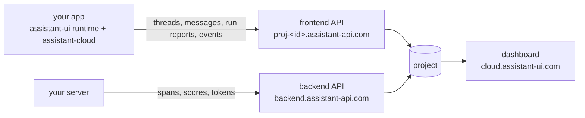

Assistant Cloud is the hosted backend for assistant-ui apps. The runtime in your app talks to it directly: threads and messages are stored as the conversation streams, every assistant response is reported with its timing, tokens, tools and outcome, and what users do around the answers is recorded as events. Your server adds the inside view by exporting its model and tool spans. The [dashboard](https://cloud.assistant-ui.com) turns all of it into pages you can read, and this book describes every one of those pages, every setting behind them, and every call the SDK makes.

## What you get

| Capability | What it means | Where it is described |
|---|---|---|
| Persistence | Threads and messages, stored as they stream, resumed across sessions and devices, listed per user, archived and deleted | [Threads](/docs/cloud/threads), [Messages](/docs/cloud/messages) |
| Titles | A model names each conversation from its first message | [Thread titles](/docs/cloud/thread-titles) |
| Run reports | Status, outcome, error, duration, time to first token, steps, tool calls, tokens, model, provider and cost for every response | [Run reports](/docs/cloud/run-reports) |
| Traces | An OpenTelemetry receiver that joins your server's spans to the browser's report | [Traces](/docs/cloud/traces) |
| Engagement | Sends, stops, edits, regenerations, copies and more, recorded without message text, plus thumbs and the scores your own code writes | [Engagement events](/docs/cloud/engagement), [Feedback and scores](/docs/cloud/scores) |
| Intelligence | Topics, tasks, unanswered questions, sentiment and resolution, judged by a model of your choice | [Intelligence](/docs/cloud/intelligence), [Evaluators](/docs/cloud/evaluators) |
| The dashboard | Overview, Threads, Runs, Models, Users, Engagement and Intelligence over any range, with alerts, exports and an audit log | [Using the dashboard](/docs/cloud/dashboard) |

## How it fits together

A project has two hosts. The frontend API answers the browser with an anonymous session or a token from your auth provider; the backend API answers your server with an API key: minting tokens, receiving traces, writing scores, reading the project. The `assistant-cloud` package is the client for both, and the assistant-ui runtimes drive it for you. [Concepts](/docs/cloud/concepts) names every object once, and [Authentication](/docs/cloud/authorization) follows a request through the API.

## Pick your integration

| You use | The cloud adds | Guide |
|---|---|---|
| The AI SDK through `useChatRuntime`, including Mastra agents | Thread list, persistence, titles, run reports, engagement, feedback, attachments | [AI SDK](/docs/cloud/ai-sdk) |
| Your own backend through `useLocalRuntime` or `useDataStreamRuntime` | The same, over any chat model adapter | [Local runtime](/docs/cloud/local-runtime) |
| LangGraph, LangChain or Google ADK | Thread list, feedback, attachments and engagement; transcripts stay with the backend and runs come from traces | [LangGraph, LangChain and ADK](/docs/cloud/langgraph) |
| AG-UI or A2A | Everything, by composing the thread list yourself | [Custom thread list](/docs/cloud/custom-thread-list) |
| A server without a browser: a bot, an agent, a batch job | Threads, messages, titles and run reports through the client with an API key | [Servers and bots](/docs/cloud/servers) |
| A backend in another language, or a framework with OpenTelemetry | Runs, steps, tool calls and models from exported spans, or the REST API directly | [Traces](/docs/cloud/traces), [REST API](/docs/cloud/api) |
| The Cloud AI SDK, `useCloudChat` | Nothing new: the package is retired and the runtime replaces it | [Migrate from Cloud AI SDK](/docs/cloud/migrate-cloud-ai-sdk) |

[Which runtime](/docs/cloud/runtimes) is the full matrix of what each integration stores and reports. The runtime guides work on React, React Native and Ink: the packages are the same, only the environment differs.

## How the book is organised

| Section | What it holds |
|---|---|
| [Authentication and access](/docs/cloud/authorization) | The three ways a client proves who it is, the rules a project enforces, and who the user and the workspace are |
| [Conversations](/docs/cloud/threads) | Threads, messages and their formats, titles, attachments and retention |
| [Integrations](/docs/cloud/runtimes) | One guide per runtime, servers and bots, and the migration from the Cloud AI SDK |
| [Telemetry](/docs/cloud/run-reports) | Run reports field by field, traces and the receiver's rules, engagement events, feedback and scores |
| [Cloud features](/docs/cloud/llm-providers) | The features the cloud runs on your conversations with a model: providers, intelligence, evaluators, assistants and harnesses |
| [Dashboard](/docs/cloud/dashboard) | Every page of the dashboard with every figure defined |
| [Settings](/docs/cloud/settings) | Every settings page, who may change it, alerts, the audit log and billing |
| [Reference](/docs/cloud/api) | The REST API route by route, the client, the stored formats and every limit |

Every page follows the same order: what the feature is, how it works, every control with its default and bound, the calls from your code, what it costs, and a troubleshooting table of what you see, why, and what to do.

## Where to start

<Cards>
  <Card title="Quickstart" href="/docs/cloud/quickstart">
    Create a project, connect a runtime, watch the first run land in the dashboard.
  </Card>
  <Card title="Concepts" href="/docs/cloud/concepts">
    Projects, hosts, users, workspaces, threads, runs, events and scores, and one turn on the wire.
  </Card>
  <Card title="Authentication" href="/docs/cloud/authorization">
    Anonymous sessions, your auth provider's tokens, API keys and allowed origins.
  </Card>
  <Card title="Thread titles" href="/docs/cloud/thread-titles">
    How a conversation gets its name, every setting behind it, and why a thread stays Untitled.
  </Card>
  <Card title="Plans and pricing" href="/docs/cloud/pricing">
    Active users, what each plan includes, and the cap.
  </Card>
  <Card title="REST API" href="/docs/cloud/api">
    Every route, for servers in other languages and evaluation jobs.
  </Card>
</Cards>

The [demo project](https://cloud.assistant-ui.com/demo) is open without an account: a retailer's synthetic support assistant that gains an hour of conversations every hour, with every page of the dashboard read only. The screenshots in this book were taken there.

## Upgrading from 0.1

`@assistant-ui/core` requires `assistant-cloud@^0.2.1`, so update `assistant-cloud`, `@assistant-ui/react` and your integration package together. Then:

- Add the `messageMetadata` callback to your route; see [Run reports](/docs/cloud/run-reports#messagemetadata-values). Without it runs show as *No model reported* and cannot be priced.
- Pass `telemetry: { environment, release }` to `AssistantCloud` so runs can be filtered by deployment. Engagement events are on by default; see [Turning telemetry off](/docs/cloud/run-reports#redact-drop-or-turn-telemetry-off).
- If your server emits OpenTelemetry spans, add the span processor from [Traces](/docs/cloud/traces).
- Review **Settings › Access**: anonymous sessions and allowed origins are settings, and both default to open.
- If you use `@assistant-ui/cloud-ai-sdk`, plan the move: the package is retired; see [Migrate from Cloud AI SDK](/docs/cloud/migrate-cloud-ai-sdk).
