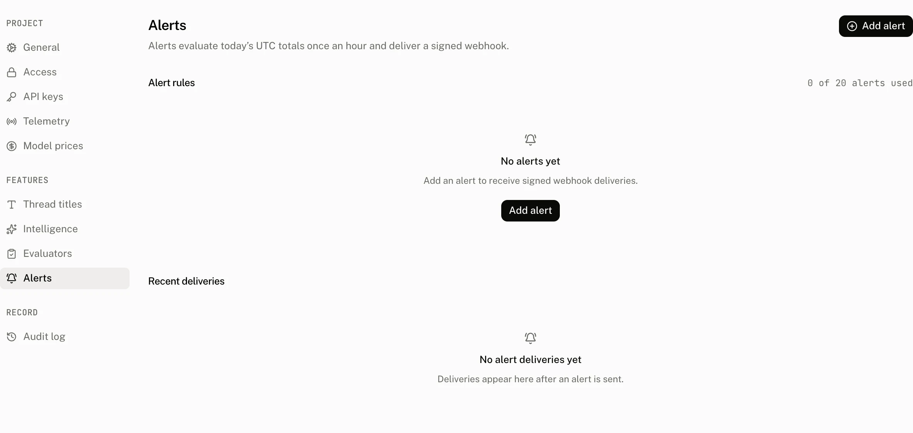

An alert rule watches one project metric and posts a signed JSON payload to a webhook when the metric is above its threshold. **Settings › Alerts** holds the rules, their delivery history and the last error for a failed delivery. Owners and admins manage every alert rule operation.

## Metrics and evaluation

Once an hour, the cloud calculates each project's totals for the current UTC day and evaluates every enabled rule. A rule triggers only when its value is strictly greater than the threshold. It does not trigger when the value equals the threshold.

| Metric | Meaning | Unit | When it is silent |
|---|---|---|---|
| `daily_cost_usd` | The sum of today's run cost. | USD | Never; a zero total cannot exceed the threshold. |
| `daily_error_rate` | Today's error runs divided by today's runs. | % | The day has no runs. |
| `daily_incomplete_rate` | Today's incomplete runs divided by today's runs. | % | The day has no runs. |
| `daily_runs` | The sum of today's runs. | runs | Never; a zero total cannot exceed the threshold. |
| `period_active_users` | Active users in the current UTC calendar month. | users | Never; a zero total cannot exceed the threshold. |
| `daily_cost_usd_change` | Today's cost compared with the mean of the preceding 7 days. | % rise | Fewer than 3 days of history exist, or the baseline is zero. |
| `daily_incomplete_rate_change` | Today's incomplete rate compared with the preceding 7 days. | % rise | Fewer than 3 days of history exist, either rate is unavailable, or the baseline is zero. |
| `daily_runs_change` | Today's runs compared with the mean of the preceding 7 days. | % rise | Fewer than 3 days of history exist, or the baseline is zero. |

The cloud calculates daily metrics once for the project, then evaluates its rules. A successful delivery writes a delivery event, records when the rule last triggered and clears the rule's last error. The cooldown is counted from that successful delivery. A failed delivery writes a failed event and updates the last error, but does not begin the cooldown.

## Configure a rule



| Control | Default | Accepts | Effect and validation |
|---|---|---|---|
| **Name** |  | A trimmed name from 1 to 64 characters. | Names the rule and must be unique in the project. An empty name reads `Enter a name`. |
| **Metric** | Daily cost | One of the metrics above. | Chooses the figure and unit the threshold uses. |
| **Threshold**, **Threshold (%)** or **Threshold (% rise)** |  | A finite value of 0 or more. | The generic validation message is `Enter a value of 0 or more`. Daily error rate and daily incomplete rate also accept at most 100 with up to 2 decimal places, or read `Enter a percentage from 0 to 100 with up to two decimals`. |
| **Cooldown minutes** | 1,440 minutes | Whole minutes from 5 to 10,080. | Waits this long after a successful delivery. A value outside the range reads `Enter whole minutes from 5 to 10,080`. |
| **Webhook URL** |  | A trimmed URL from 1 to 2,048 characters, using public HTTPS. | Receives a signed JSON `POST`. An empty value reads `Enter a webhook URL`. |
| **Enabled** | On | On or off. | Off retains the rule, its secret and its history, but stops evaluation and delivery. |

The two rate metrics, `daily_error_rate` and `daily_incomplete_rate`, are stored as fractions. The form divides their displayed percentage by 100 when it saves and multiplies it by 100 when it reads it. Every other threshold is stored exactly as typed.

Create returns the webhook signing secret once, and the secret dialog says `Copy this secret now. It will not be shown again.` Edit changes a rule and records `alert_rule.update`. Enable and disable are edits that change `enabled` and also record `alert_rule.update`. Rotate secret returns a new secret once and records `alert_rule.rotate_secret`. Delete removes the rule and its delivery events and records `alert_rule.delete`. **Send test** delivers immediately, records a test delivery event, and records `alert_rule.test` with the delivery status and response code. Creating a rule records `alert_rule.create`.

### Rule allowance

| Plan | Alert rules |
|---|---|
| Free | 1 |
| Pro | 20 |
| Startup | 20 |
| Enterprise | 100 |

The server counts existing rules when it creates one and enforces the plan's allowance. A project at its limit receives `The {Plan} plan allows {maxRules} alert rules` instead of a new rule.

## Webhook delivery

The cloud sends `POST` requests with `content-type: application/json` and `x-aui-signature`. The signature header has the form `t=<unix seconds>,v1=<hex>`. Its hex value is an HMAC SHA-256 over `<t>.<body>` with the rule's plaintext secret, where `body` is the exact request body. Verify the raw body before parsing it.

```json title="alert.triggered"
{
  "type": "alert.triggered",
  "project_id": "proj_…",
  "rule": { "id": "alert_…", "name": "Daily spend", "metric": "daily_cost_usd", "threshold": "25.000000" },
  "value": 31.2,
  "day": "2026-09-13",
  "occurred_at": "2026-09-13T17:00:00.000Z"
}
```

```json title="alert.test"
{
  "type": "alert.test",
  "project_id": "proj_…",
  "rule": { "id": "alert_…", "name": "Daily spend", "metric": "daily_cost_usd", "threshold": 0 },
  "occurred_at": "2026-09-13T17:00:00.000Z"
}
```

The triggered payload's `rule.threshold` is a numeric string. The test payload's `rule.threshold` is a number.

The request has a 10 second timeout. Redirects are not followed, a target that resolves to a private address is refused, and any response in the 2xx range is a successful delivery.

```ts title="verify.ts"
import { createHmac, timingSafeEqual } from "node:crypto";

const TOLERANCE_SECONDS = 300;

export function verify(secret: string, signature: string, body: string) {
  const parts = Object.fromEntries(
    signature.split(",").map((part) => part.split("=")),
  );
  const timestamp = Number(parts.t);
  const digest = parts.v1 ?? "";
  if (!Number.isInteger(timestamp)) return false;
  if (Math.abs(Date.now() / 1000 - timestamp) > TOLERANCE_SECONDS) return false;
  if (!/^[0-9a-f]{64}$/.test(digest)) return false;
  const expected = createHmac("sha256", secret)
    .update(`${parts.t}.${body}`)
    .digest("hex");
  return timingSafeEqual(Buffer.from(expected), Buffer.from(digest));
}
```

## Recent deliveries

**Recent deliveries** shows the latest 50 triggered or test deliveries across the project. Each row has the relative time, rule, a `Test` badge when applicable, delivery status and the response code, or `None` when there was no response. The Alert rules table also shows the rule's channel host, cooldown, enabled state and actions. A failed delivery remains on the rule as its last error until a later successful delivery clears it.

## Troubleshooting

| What you see | Why | What to do |
|---|---|---|
| The rule did not deliver at the threshold. | Rules trigger only above the threshold. | Set a lower threshold if the current value should trigger it. |
| A rate rule is quiet. | The UTC day has no runs. | Wait until the project has runs that day. |
| A change rule is quiet. | It needs at least 3 days of history and a nonzero baseline. | Wait for sufficient history, then review the baseline metric. |
| The rule did not deliver again. | Its most recent successful delivery is still inside the cooldown. | Wait for the configured cooldown to elapse. |
| Send test or a triggered delivery failed. | The receiver timed out, returned a non 2xx response, redirected, or resolved to a private address. | Read the rule's last error and Recent deliveries, then use a public HTTPS endpoint that accepts the request within 10 seconds. |
| Signature verification fails. | The receiver did not use the raw body, the timestamp, or the current secret. | Verify `t.<raw body>` with the current secret. Rotate the secret if it was lost. |
