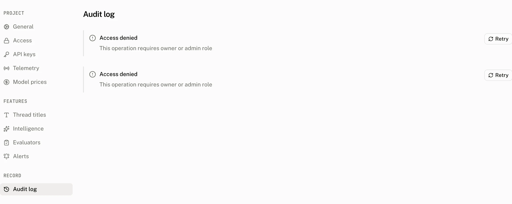

The audit log records project configuration and data changes made through the dashboard and the API. **Settings › Audit log** is available to owners and admins. Each entry preserves the actor and the change even when the resource it refers to has later been deleted.

## What an entry records

| Part | What it holds |
|---|---|
| Actor | The actor type, id and label captured when the change was written. |
| Action | The operation that made the change, such as `alert_rule.create`. |
| Resource | The resource type and resource id the operation changed. |
| Changed fields | The before and after values, reduced to only the fields that changed. |

Values whose field name matches `api_key`, `credentials`, `secret`, `sha256` or `suffix` are redacted, regardless of case. A rule creation can therefore be recorded without exposing the webhook signing secret, and an API key operation can be recorded without exposing the key.

### Actions by resource

| Resource type | Actions |
|---|---|
| `project` | `project.create`, `project.update`, `project.retention.cancel` |
| `api_key` | `api_key.create`, `api_key.delete` |
| `auth_rule` | `auth_rule.create`, `auth_rule.update`, `auth_rule.delete` |
| `provider` | `provider.create`, `provider.update`, `provider.delete` |
| `assistant` | `assistant.create`, `assistant.update`, `assistant.delete` |
| `feature` | `feature.update` |
| `alert_rule` | `alert_rule.create`, `alert_rule.update`, `alert_rule.rotate_secret`, `alert_rule.delete`, `alert_rule.test` |
| `evaluator` | `evaluator.create`, `evaluator.update`, `evaluator.delete` |
| `model_price` | `model_price.create`, `model_price.update`, `model_price.delete` |
| `harness` | `harness.create`, `harness.update`, `harness.delete` |
| `intelligence_request` | `intelligence.request` |
| `task` | `task.skill.create` |
| `score` | `score.create`, `score.update` |
| `user` | `user.erase` |

Dashboard changes made by a signed in person are recorded with actor type `user`, their session user id and their email when it is available, otherwise their name. The log stores that label at write time. It can also hold `api_key` and `system` actor types.

## Find an entry

Use the resource filter to choose one of the resource types above. The actor filter accepts text, and the filter options show actors with their captured labels and entry counts. The page reads the selected resource from the URL and validates it before loading results.

Entries are newest first. Each page returns 50 entries and uses a keyset cursor of the last entry's creation time and id. **Load more** asks for the next page only when a 51st entry exists.

## User erasure

A server can erase a project user with [`DELETE /v1/projects/users/{user_id}`](/docs/cloud/api/users). The route requires an API key. After the erasure transaction commits, the API records `user.erase` on the `user` resource. The API key is the actor: its id is the actor id and its name is the actor label. The entry's after value records the number of the user's threads deleted and runs reattributed.

## Configuration markers on Overview

The Overview chart uses a separate configuration marker read, not the full audit log. It is available without the owner or admin requirement and returns at most 100 changes in the selected range. It includes only `feature`, `project`, `provider` and `model_price` resources, rendered as markers such as a thread title setting change, a pending retention change, a provider addition or a model price change.

## Troubleshooting

| What you see | Why | What to do |
|---|---|---|
| An entry records a change you did not make. | The entry records the authenticated actor and the changed fields at the time of the operation. | Filter by the resource and actor, then compare the actor label, action and before and after values. |
| A secret or API key value is missing. | Fields named `api_key`, `credentials`, `secret`, `sha256` or `suffix` are redacted. | Use the audit log to confirm the operation, not to recover the secret. |
| An actor appears as an email address. | Dashboard user actions use the session email as the actor label when one is available. | Treat the email as the identity label captured for that entry. |
| A change appears on Overview but not in the current audit log results. | Overview reads configuration markers separately, and the audit log may be filtered or on a later page. | Clear the resource or actor filter, then load more entries. |
