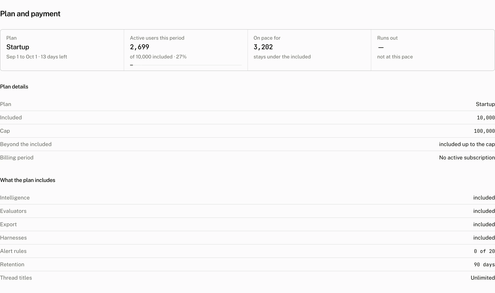
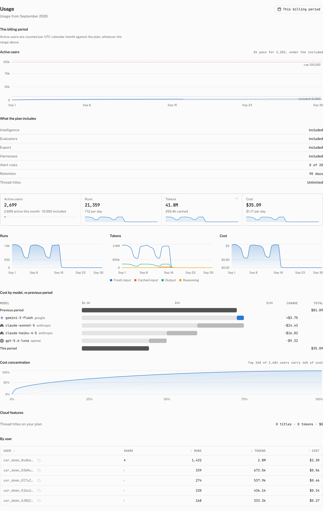

**Billing** explains the plan's current period, active user allowance and projected use. **Usage** shows the period's activity and cost by day, model and user. Owners and admins can manage billing; every member can read project pages.

## Billing



### Plan and active users

The **Plan** tile shows the plan name, the start and end dates of the current period, and the days left in it. That period is the UTC calendar month, the same one the active user limit uses, and every projection below counts its remaining days.

**Active users this period** counts each end user once after they send at least one message in the UTC calendar month. Its meter has an included stop and a cap stop. The meter's maximum is the cap when the plan has one, otherwise the included number. It reads `of {included} included · {percentage}` when there is an included allowance, or `counted, not limited` when there is no limit.

### Pace and projected use

**On pace for** starts with the active user count from 7 days ago. It calculates the daily pace as the increase over that period divided by 7, then projects `round(active users + pace × days left)`. When the plan has a per user price, the tile also shows the projected overage. When it does not, the tile reads that the projection stays under the included number, is a number over the included number, or has no limit on the plan.

**Runs out** uses the same pace. When a cap exists and pace is positive, the cloud calculates the days to cap as `ceil((cap - active users) / pace)`. It shows a date only when that day falls within the current period. Otherwise it reads `capped`, a date, or `not at this pace`.

### Plan details

| Reading | Meaning |
|---|---|
| Plan | The project's current plan. |
| Included | The active users the plan price covers. |
| Cap | The maximum active users the API permits in the period. |
| Beyond the included | `no limit`, `hard stop`, a per user price, or `included up to the cap`. `hard stop` applies when the cap and included number are the same. |
| Billing period | The period returned by the subscription. |

### What the plan includes

The feature rows are **Intelligence**, **Evaluators**, **Export** and **Harnesses**. Each row says `included` when the plan has the feature, or shows the cheapest plan that has it and opens the pricing dialog. **Alert rules** reads `{used} of {max}`. **Retention** reads `forever` or the number of days. **Thread titles** reads the title allowance as unlimited, a monthly number, or a monthly included number with a cap.

## Change a plan or payment method

**Upgrade** opens the pricing dialog when the organization has no active subscription. Choosing Pro opens the payment link. Choosing Startup or Enterprise books a call. The only plan change made inside the product is a downgrade to Free.

With an active subscription, the action is **Open Stripe portal**. The portal manages the subscription and is the place to cancel it. Owners and admins can see these actions and use the portal. Other members can read Billing but cannot manage payment or plan changes.

### Free plan banner

The free plan banner in the sidebar reads `{active} of {limit} active users this month · {percentage}` and turns red at 80% or more. Once the plan has stopped new active users, it reads `Active users capped since {date}`. **Upgrade to Pro** opens the pricing flow. Dismissing the banner hides it in that browser for 30 days.

## Usage



Usage opens to the current month. **This billing period** says: `Active users are counted per UTC calendar month against the plan, whatever the range above.` It includes the active user meter and the **What the plan includes** section from Billing.

The page has tiles for **Active users**, **Runs**, **Tokens** and **Cost**. Its charts are **Runs**, **Tokens**, **Cost**, **Cost by model, vs previous period** and **Cost concentration**. **Cloud features** separates **Thread titles on your plan** from **Thread titles on your key**. **By user** lists users with sortable **User**, **Runs**, **Tokens** and **Cost** columns.

## Plan enforcement

The plan's active user cap is enforced when a new end user sends a user message through `POST /v1/threads/{thread_id}/messages`. A user already counted in the period can continue. At the cap, a new user receives HTTP 402:

```json title="Response"
{
  "error": "plan_limit_reached",
  "plan": "free",
  "period_end": "2026-10-01T00:00:00.000Z",
  "cap": 200
}
```

See [Users and workspaces](/docs/cloud/users-and-workspaces) for how the cloud identifies the user whose activity is counted.

## Troubleshooting

| What you see | Why | What to do |
|---|---|---|
| Upgrade is not shown. | Only owners and admins manage billing. An active subscription shows the portal action instead of Upgrade. | Ask an owner or admin to manage the plan, or use **Open Stripe portal** for an active subscription. |
| Active users differs from the Users page. | Billing counts each end user once in the UTC calendar month after a message, rather than reading a user list. | Use the Billing meter for the plan allowance and the Users page to inspect individual users. |
| A title count stopped growing. | Thread titles on the plan and on your key are separate readings. A plan title cap stops titles paid by the plan for the rest of the month. | Check both Cloud features rows and the plan's title allowance. |
