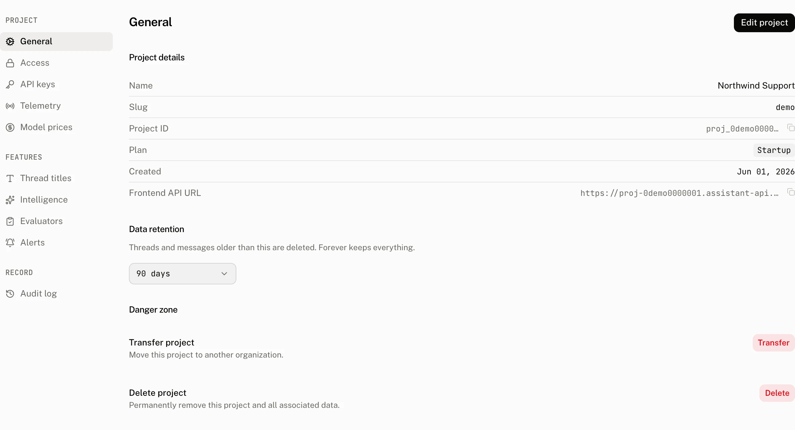

**Settings › General** is the record of a project's identity and the place to change its name, address, icon, colour and retention. It also holds the support managed actions that can move or remove the project.

## Project details

The read only Project details section answers which project the dashboard is showing and which endpoint a browser should use.

| Row | What it shows |
|---|---|
| Name | The project name. |
| Slug | The project address within its organization. |
| Project ID | The copyable project identifier. |
| Plan | The project's plan. |
| Created | When the project was created. |
| Frontend API URL | The browser endpoint for the project. The cloud forms it as `https://{project ID with its first _ replaced by -}.assistant-api.com`. |

## Edit project

Use **Edit project** to change the Project name and Project slug. The name must contain 4 to 255 characters. The slug must contain 4 to 32 characters, use only lowercase letters, digits and hyphens, start with a lowercase letter, end with a lowercase letter or digit, and not contain consecutive hyphens. The slug field shows the organization path that will contain it.

The dialog also has the icon and colour picker. An icon can contain up to 8 characters. A colour is a six digit hexadecimal value beginning with `#`.

The dialog reports these validation messages exactly:

| Condition | Message |
|---|---|
| The slug contains a character outside the allowed set | `Slug may contain only lowercase characters, digits and '-'.` |
| The slug does not start with a lowercase character | `Slug must start with a lowercase character.` |
| The slug does not end with a lowercase character or digit | `Slug must end with a lowercase character or digit.` |
| The slug has consecutive hyphens | `Slug cannot contain consecutive dashes --.` |
| Another project already uses the slug | `A project with this slug already exists.` |

Saving a slug rename replaces the current settings address with the new slug's settings URL. Update any saved dashboard address after the rename.

## Data retention

**Data retention** lets an owner or admin select Forever or a retention period. The control keeps its current nonstandard value when necessary. Read [Data retention](/docs/cloud/retention) for the available periods, deletion rules, scheduled shortening changes and cancellation.

## Danger zone

**Transfer project** and **Delete project** both continue through support. Delete asks you to type the project name and the literal `CONFIRM DELETE` before it opens the support request.

## Permissions and audit record

Signed in members may change the project name, slug, icon and colour. Only owners and admins may set or cancel retention. The audit log records project edits as `project.update` and a cancelled retention schedule as `project.retention.cancel`.

Each audit row captures the actor, action, resource and fields before and after the write. It keeps only fields that changed and redacts secret shaped values.

## Troubleshooting

| What you see | Why | What to do |
|---|---|---|
| A slug is refused | It is outside the 4 to 32 character rule, fails one of the slug rules, or another project already has it. | Correct the slug using the message in the dialog, or choose a different unused slug. |
| The settings page appears to leave after a rename | The dashboard replaces the current route with the settings URL for the new slug. | Continue from the new URL and replace any old bookmark. |
| A retention change is waiting | A shorter retention period is scheduled before it takes effect. | Review the pending change on the page. You can cancel it before its effective time. |
