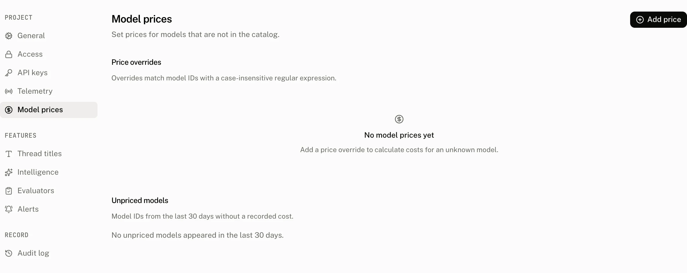
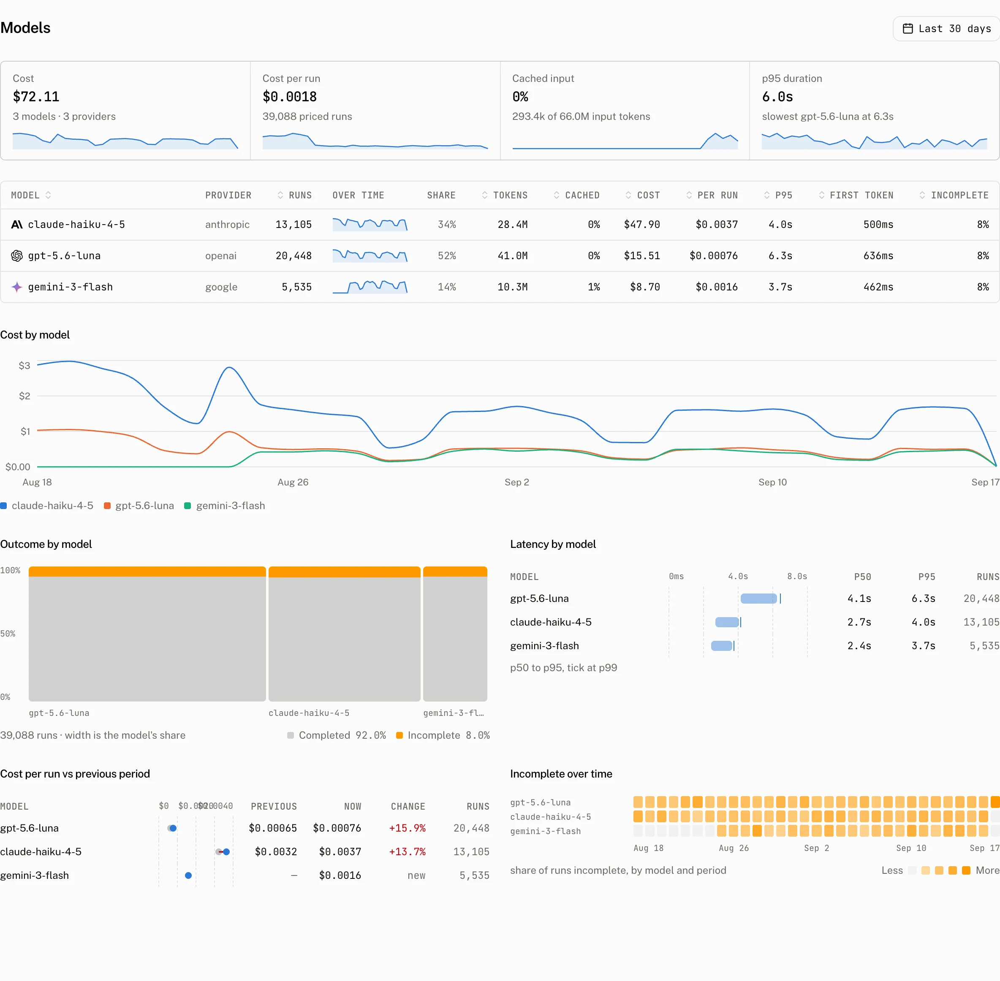

**Settings › Model prices** lets you price a model the catalog does not know, replace a catalog rate with a negotiated rate, or price a reseller's model ID. Each override applies when later runs are stored, and the page also identifies recent model IDs that still have no recorded cost.

## How a stored run gets a price

When the cloud stores a run, it resolves the provider and looks up the catalog price keyed by that provider. For a stored provider, its provider key is the catalog key. The cloud then considers this project's matching price overrides.

A caller supplied `cost_details` or `cost_usd` wins over both the catalog and an override. When a report carries both and `cost_details` is not empty, `cost_details` wins: the run cost is its `total`, or the sum of `input`, `input_cached_tokens`, and `output` when `total` is absent, and `cost_usd` is ignored. The project's price overrides are cached for 60 seconds, so a just saved row can take up to that long to reach new run writes.

## Price overrides



An override has a **Match pattern**, an optional **Provider**, and prices for **Input**, **Cache read** and **Output**. The match pattern is a case insensitive regular expression against the model ID. Leave Provider empty to match any provider. All prices are USD per 1M tokens. Leave Cache read empty to use the Input price.

| Field | Accepts | Effect |
|---|---|---|
| Match pattern | A nonempty regular expression | Selects model IDs without regard to case. |
| Provider | An optional provider name | Limits the override to that provider when present. |
| Input | A nonnegative price | Prices input tokens. |
| Cache read | An optional nonnegative price | Prices cached input tokens, or uses the Input price when empty. |
| Output | A nonnegative price | Prices output tokens. |

The page refuses a pattern that cannot compile with `Match pattern must be a valid regular expression`. If the preview query is a regular expression PostgreSQL cannot run, it reports `Match pattern is not valid for PostgreSQL`.

Before saving, the preview shows distinct model IDs from the last 30 days that match the pattern. A saved override applies to runs stored after it exists. A member can create, update or remove an override.

## Unpriced models

The **Unpriced models** section lists model IDs from the last 30 days that have no recorded cost. It excludes system runs, groups by provider and model ID, and shows at most 50 groups by count. Each row has a shortcut to add a price for that model.

When your contract has a rate the catalog does not know, put the price on the report itself. `beforeReport` sees every report the client is about to send:

```ts title="Send the price with the report"
import { AssistantCloud, type AssistantCloudRunReport } from "assistant-cloud";

const inputUsdPerToken = 0.15 / 1_000_000;
const cachedInputUsdPerToken = 0.015 / 1_000_000;
const outputUsdPerToken = 0.6 / 1_000_000;

const withPrice = (report: AssistantCloudRunReport) => {
  if (report.input_tokens === undefined || report.output_tokens === undefined) {
    return report;
  }
  const cached = report.cached_input_tokens ?? 0;
  const cost_usd =
    (report.input_tokens - cached) * inputUsdPerToken +
    cached * cachedInputUsdPerToken +
    report.output_tokens * outputUsdPerToken;
  return { ...report, cost_usd };
};

const cloud = new AssistantCloud({
  baseUrl: process.env.NEXT_PUBLIC_ASSISTANT_BASE_URL!,
  authToken: getAccessToken,
  telemetry: {
    beforeReport: withPrice,
  },
});
```

`input_tokens` includes the cached tokens, so the cached share is taken out and priced at its own rate, as the catalog does. A report without token counts is sent unchanged, so the catalog still prices it. A caller supplied `cost_usd` takes precedence over catalog and override prices.

## How Models reads price data



The [Models page](/docs/cloud/dashboard/models) groups runs by the catalog's canonical model ID and provider, while retaining the model IDs clients reported. Its rows include priced and unpriced run counts. On a model detail page, **Price** shows Priced as, Input, Cached input and Output for the model.

## Audit record

Creating, updating and deleting an override write `model_price.create`, `model_price.update` and `model_price.delete` to the audit log. An audit row retains the actor, action and changed fields before and after the write, with secret shaped values redacted.

## Troubleshooting

| What you see | Why | What to do |
|---|---|---|
| A run is still unpriced after adding a row | Overrides apply only to runs stored after the row exists, and new writes can use the previous cached set for up to 60 seconds. | Check that the pattern and optional Provider match the model, then send or store a later run after the cache window. |
| A pattern matches too much | Matching is a case insensitive regular expression, so an unanchored expression can select more model IDs than intended. | Use a narrower expression, such as anchors around the full model ID, and inspect the 30 day preview. |
| A stored price differs from the invoice | The caller may have supplied `cost_details` or `cost_usd`, which wins over the catalog and every override. | Inspect the run's reported cost fields before changing the catalog or override rate. |
