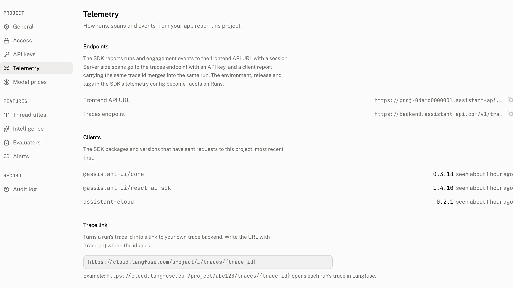

**Settings › Telemetry** connects the browser and server endpoints to the project, optionally links stored trace IDs to your trace backend, and shows which SDK versions still send requests. It is the page to check when telemetry reaches the cloud but a trace or client row is missing.

## Endpoints

The endpoints are read only. Browser SDKs report runs and engagement events to the Frontend API URL with a session. Server side spans use the traces endpoint with an API key. A client report and a server span with the same trace ID merge into the same run.

| Row | Use | Value |
|---|---|---|
| Frontend API URL | Browser telemetry | The project's browser endpoint. |
| Traces endpoint | Server side spans | For a Frontend API URL on `*.assistant-api.com`, `https://backend.assistant-api.com/v1/traces`. For another origin, `{origin}/v1/traces`. |

## Trace link

**Trace link template** turns a stored trace ID into a link to your trace backend. It may be empty, but when present it must be no more than 512 characters and include the literal `{trace_id}`. Otherwise the page reports `Trace link must include {trace_id}.`

For example, `https://cloud.langfuse.com/project/abc123/traces/{trace_id}` opens each run's trace in Langfuse. The Run detail page turns its **Trace id** row into that link when the run has a trace ID and the template is saved.

A member saves the template with the project update. The audit log records the write as `project.update`.

## Clients

The Clients list answers which SDK packages and versions have sent requests to this project, so you can find apps that still use an old SDK release.

Each request can carry an `Aui-Sdk` header with up to 8 `name/semver` tokens. A name can be up to 214 characters and a version up to 64 characters. The cloud records a client at most once per project, name and version every 10 minutes.

| Page behavior | Detail |
|---|---|
| Ordering | Most recently seen first. Ties sort by name, then version. |
| Row | SDK name, SDK version and when it was last seen. |
| Empty state | `No SDK requests yet` |
| Retention | A client not seen for 180 days is removed. |

## Troubleshooting

| What you see | Why | What to do |
|---|---|---|
| A client is missing | Its requests did not supply an `Aui-Sdk` token the cloud can record, or the latest write is within the 10 minute throttle. | Send a request with the package `name/semver` token and check the list after the throttle window. |
| A trace link does not appear on a run | The run has no trace ID, or no saved template contains `{trace_id}`. | Store the run's trace ID and save a template that includes the literal placeholder. |
| The template is refused | It exceeds 512 characters or does not contain the required placeholder. | Shorten it if needed and include `{trace_id}` exactly. |
