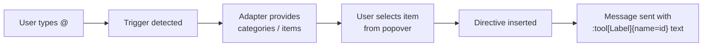

Mentions let users type `@` in the composer to open a popover picker, select an item (e.g. a tool), and insert a directive into the message text. The LLM can then use the directive as a hint.

<AgentSetup product="guides/mentions" />

## How It Works



The mention system has three layers:

1. **Trigger detection** — the composer input watches for a trigger character (`@` by default) and extracts the query
2. **Adapter** — provides the categories and items to display in the popover (e.g. registered tools)
3. **Formatter** — serializes a selected item into directive text (`:type[label]{name=id}`) and parses it back for rendering

Under the hood, mentions are one kind of [trigger popover](/docs/guides/slash-commands#trigger-popover-architecture). A mention declares its behavior with a `<TriggerPopover.Directive>` sub-primitive, which writes the formatter-serialized directive into the composer on selection.

## Quick Start

The fastest path is the pre-built [Mention UI components](/elements/composer-trigger-popover), which wire everything together with two shadcn components — the popover picker and the message-side chip renderer:

<InstallCommand shadcn={["composer-trigger-popover", "directive-text"]} />

See the [Composer Trigger Popover](/elements/composer-trigger-popover) and [Directive Text](/elements/directive-text) guides for setup steps.

The rest of this guide covers the underlying concepts and customization points.

## Trigger Adapter

A `Unstable_TriggerAdapter` provides the data for the popover. All methods are **synchronous** — use external state management (React Query, SWR, local state) for async data, then expose loaded results through the adapter.

```ts
import type { Unstable_TriggerAdapter } from "@assistant-ui/core";

const myAdapter: Unstable_TriggerAdapter = {
  categories() {
    return [
      { id: "tools", label: "Tools" },
      { id: "users", label: "Users" },
    ];
  },

  categoryItems(categoryId) {
    if (categoryId === "tools") {
      return [
        { id: "search", type: "tool", label: "Search" },
        { id: "calculator", type: "tool", label: "Calculator" },
      ];
    }
    if (categoryId === "users") {
      return [
        { id: "alice", type: "user", label: "Alice" },
        { id: "bob", type: "user", label: "Bob" },
      ];
    }
    return [];
  },

  // Optional — global search across all categories
  search(query) {
    const lower = query.toLowerCase();
    const all = [
      ...this.categoryItems("tools"),
      ...this.categoryItems("users"),
    ];
    return all.filter(
      (item) =>
        item.label.toLowerCase().includes(lower) ||
        item.id.toLowerCase().includes(lower),
    );
  },
};
```

### Async Mention Search

The built-in `unstable_useLiveCompletionAdapter` wraps an async fetcher with debouncing, stale-request cancellation (results for an outdated query are dropped), and a single-entry cache. Its `search` returns the last results synchronously and schedules a debounced fetch when the query changes; when results arrive the returned `adapter` re-creates, which re-runs the popover lookup so the fresh items render. It also reports `isLoading`, which you pass to the popover to show a loading state.

When the fetcher reads from an account- or workspace-specific source, pass that source ID as `cacheKey`. Changing the key clears cached results and cancels any pending result from the previous source.

```tsx
import {
  unstable_useLiveCompletionAdapter,
  unstable_defaultDirectiveFormatter,
} from "@assistant-ui/react";
import { ComposerTriggerPopover } from "@/components/assistant-ui/elements/composer-trigger-popover.aui";

function MentionPopover() {
  const mentions = unstable_useLiveCompletionAdapter({
    fetcher: async (query) => {
      const users = await fetchUsers(query);
      return users.map((u) => ({ id: u.id, type: "user", label: u.name }));
    },
  });

  return (
    <ComposerTriggerPopover
      char="@"
      adapter={mentions.adapter}
      isLoading={mentions.isLoading}
      directive={{ formatter: unstable_defaultDirectiveFormatter }}
    />
  );
}
```

The adapter interface is itself synchronous, so you can also wire async data by hand when you need a custom cache, no debounce, or an existing query client. Load results into React state (or a query cache) and read the current snapshot inside the adapter methods. The adapter re-creates on each render, so the popover always sees the latest results.

**With React state and `useEffect`:**

```tsx
import { useState, useEffect, useMemo } from "react";
import type { Unstable_TriggerAdapter } from "@assistant-ui/core";

function useUserMentionAdapter(query: string) {
  const [users, setUsers] = useState<{ id: string; name: string }[]>([]);

  useEffect(() => {
    if (!query) return;
    let cancelled = false;
    fetchUsers(query).then((results) => {
      if (!cancelled) setUsers(results);
    });
    return () => { cancelled = true; };
  }, [query]);

  const adapter: Unstable_TriggerAdapter = useMemo(() => ({
    categories: () => [],
    categoryItems: () => [],
    search: () =>
      users.map((u) => ({ id: u.id, type: "user", label: u.name })),
  }), [users]);

  return adapter;
}
```

`query` here is the text the user typed after `@`. You can read it from `unstable_useTriggerPopoverScopeContext` if you need it inside the component tree, or pass it as state from a controlled input.

**With React Query:**

```tsx
import { useQuery } from "@tanstack/react-query";
import type { Unstable_TriggerAdapter } from "@assistant-ui/core";

function useMentionAdapter(query: string): Unstable_TriggerAdapter {
  const { data = [] } = useQuery({
    queryKey: ["mention-search", query],
    queryFn: () => fetchUsers(query),
    enabled: query.length > 0,
  });

  return useMemo(() => ({
    categories: () => [],
    categoryItems: () => [],
    search: () =>
      data.map((u) => ({ id: u.id, type: "user", label: u.name })),
  }), [data]);
}
```

Pass the adapter to `TriggerPopover` and declare a `Directive` sub-primitive to bind the insertion behavior:

```tsx
import { ComposerPrimitive } from "@assistant-ui/react";
import { unstable_defaultDirectiveFormatter } from "@assistant-ui/react";

<ComposerPrimitive.Unstable_TriggerPopoverRoot>
  <ComposerPrimitive.Root>
    <ComposerPrimitive.Input placeholder="Type @ to mention..." />
    <ComposerPrimitive.Unstable_TriggerPopover
      char="@"
      adapter={myAdapter}
    >
      <ComposerPrimitive.Unstable_TriggerPopover.Directive
        formatter={unstable_defaultDirectiveFormatter}
      />
      <ComposerPrimitive.Unstable_TriggerPopoverCategories>
        {(categories) =>
          categories.map((cat) => (
            <ComposerPrimitive.Unstable_TriggerPopoverCategoryItem
              key={cat.id}
              categoryId={cat.id}
            >
              {cat.label}
            </ComposerPrimitive.Unstable_TriggerPopoverCategoryItem>
          ))
        }
      </ComposerPrimitive.Unstable_TriggerPopoverCategories>
      <ComposerPrimitive.Unstable_TriggerPopoverItems>
        {(items) =>
          items.map((item) => (
            <ComposerPrimitive.Unstable_TriggerPopoverItem
              key={item.id}
              item={item}
            >
              {item.label}
            </ComposerPrimitive.Unstable_TriggerPopoverItem>
          ))
        }
      </ComposerPrimitive.Unstable_TriggerPopoverItems>
    </ComposerPrimitive.Unstable_TriggerPopover>
  </ComposerPrimitive.Root>
</ComposerPrimitive.Unstable_TriggerPopoverRoot>
```

Exactly one behavior sub-primitive (`Directive` or `Action`) is allowed per `TriggerPopover`. The parent reads the registered behavior and wires the selection machinery.

### Built-in Mention Adapter

`unstable_useMentionAdapter` covers the common cases: mention registered tools, add your own items, mix tools with custom items, or show multi-category drill-down.

**Tools from model context (default):**

```tsx
import { unstable_useMentionAdapter } from "@assistant-ui/react";

const mention = unstable_useMentionAdapter();
// → { adapter, directive } — spread into <ComposerTriggerPopover {...mention} />
// Default: single "Tools" category reading from toolkit registrations
```

**Custom items only (no tools):**

```tsx
const mention = unstable_useMentionAdapter({
  items: [
    { id: "alice", type: "user", label: "Alice", icon: "User" },
    { id: "bob", type: "user", label: "Bob", icon: "User" },
  ],
});
```

**Mix custom items with model-context tools (flat):**

```tsx
const mention = unstable_useMentionAdapter({
  items: [{ id: "kb", type: "doc", label: "Knowledge Base", icon: "Book" }],
  includeModelContextTools: true,
});
```

**Multi-category drill-down:**

```tsx
const mention = unstable_useMentionAdapter({
  categories: [
    {
      id: "users",
      label: "Users",
      items: [
        { id: "alice", type: "user", label: "Alice", icon: "User" },
        { id: "bob", type: "user", label: "Bob", icon: "User" },
      ],
    },
    {
      id: "files",
      label: "Files",
      items: [
        { id: "readme", type: "file", label: "README.md", icon: "FileText" },
      ],
    },
  ],
  // Tools auto-appended as their own category (default id "tools", label "Tools")
  includeModelContextTools: true,
});
```

**Tool formatting and category override:**

```tsx
const mention = unstable_useMentionAdapter({
  categories: [{ id: "users", label: "Users", items: [...] }],
  includeModelContextTools: {
    category: { id: "integrations", label: "Integrations" },
    formatLabel: (name) =>
      name.replaceAll("_", " ").replace(/\b\w/g, (c) => c.toUpperCase()),
    icon: "Wrench",
  },
});
```

**Options summary:**

| Option | Type | Behavior |
| --- | --- | --- |
| `items` | `Unstable_Mention[]` | Flat list (ignored when `categories` is set); supplying it keeps the adapter flat even when a tool `category` is configured |
| `categories` | `{id, label, items}[]` | Drill-down groups |
| `includeModelContextTools` | `boolean \| object` | Default: `true` iff neither `items` nor `categories`; an object `category` selects drill-down on its own unless `items` is given |
| `formatter` | `Unstable_DirectiveFormatter` | Override directive serialization (default: `unstable_defaultDirectiveFormatter`) |
| `onInserted` | `(item) => void` | Fires after the directive is inserted into the composer |
| `iconMap` | `Record<string, IconComponent>` | Maps `metadata.icon` / category `id` strings to React components |
| `fallbackIcon` | `IconComponent` | Fallback when no entry in `iconMap` matches |

`icon` on each mention is a shortcut for `metadata.icon` that the picker UI resolves via `iconMap`. Dedup between custom items and model-context tools is by `id` — explicit items win.

The hook returns `{ adapter, directive, iconMap?, fallbackIcon? }` — spread into `<ComposerTriggerPopover {...mention} />` for one-line wiring. Callers consuming the raw primitives instead destructure: `mention.adapter`, `mention.directive.formatter`, etc.

## Directive Format

When a user selects a mention item, it is serialized into the composer text as a **directive**. The default format is:

```
:type[label]{name=id}
```

For example, selecting a tool named "get_weather" with label "Get Weather" produces:

```
:tool[Get Weather]{name=get_weather}
```

When `id` equals `label`, the `{name=…}` attribute is omitted for brevity:

```
:tool[search]
```

### Custom Formatter

Implement `Unstable_DirectiveFormatter` to use a different format:

```ts
import type { Unstable_DirectiveFormatter } from "@assistant-ui/react";

const slashFormatter: Unstable_DirectiveFormatter = {
  serialize(item) {
    return `/${item.id}`;
  },

  parse(text) {
    const segments = [];
    const re = /\/(\w+)/g;
    let lastIndex = 0;
    let match;

    while ((match = re.exec(text)) !== null) {
      if (match.index > lastIndex) {
        segments.push({ kind: "text" as const, text: text.slice(lastIndex, match.index) });
      }
      segments.push({
        kind: "mention" as const,
        type: "tool",
        label: match[1]!,
        id: match[1]!,
      });
      lastIndex = re.lastIndex;
    }

    if (lastIndex < text.length) {
      segments.push({ kind: "text" as const, text: text.slice(lastIndex) });
    }

    return segments;
  },
};
```

Pass it to the trigger's `Directive` sub-primitive and the message renderer:

```tsx
// Composer
<ComposerPrimitive.Unstable_TriggerPopover
  char="@"
  adapter={adapter}
>
  <ComposerPrimitive.Unstable_TriggerPopover.Directive formatter={slashFormatter} />
  ...
</ComposerPrimitive.Unstable_TriggerPopover>

// User messages
const SlashDirectiveText = createDirectiveText(slashFormatter);
<MessagePrimitive.Parts components={{ Text: SlashDirectiveText }} />
```

## Textarea vs Lexical

The mention system supports two input modes:

| | Textarea (default) | Lexical |
| --- | --- | --- |
| **Input component** | `ComposerPrimitive.Input` | `LexicalComposerInput` |
| **Mention display in composer** | Raw directive text (`:tool[Label]`) | Inline chips (atomic nodes) |
| **Dependencies** | None | `@assistant-ui/react-lexical` and its Lexical peers: `lexical`, `@lexical/react`, `@lexical/utils`, `@lexical/history`, `@lexical/plain-text` |
| **Best for** | Simple setups, minimal bundle | Rich editing, polished UX |

With **textarea**, selecting a mention inserts the directive string directly into the text. The user sees `:tool[Get Weather]{name=get_weather}` in the input.

With **Lexical**, selected mentions appear as styled inline chips that behave as atomic units — they can be selected, deleted, and undone as a whole. The underlying text still uses the directive format.

```tsx
import { LexicalComposerInput } from "@assistant-ui/react-lexical";

<ComposerPrimitive.Unstable_TriggerPopoverRoot>
  <ComposerPrimitive.Root>
    <LexicalComposerInput placeholder="Type @ to mention..." />
    <ComposerPrimitive.Send />
    <ComposerPrimitive.Unstable_TriggerPopover
      char="@"
      adapter={adapter}
    >
      <ComposerPrimitive.Unstable_TriggerPopover.Directive formatter={formatter} />
      ...
    </ComposerPrimitive.Unstable_TriggerPopover>
  </ComposerPrimitive.Root>
</ComposerPrimitive.Unstable_TriggerPopoverRoot>
```

`LexicalComposerInput` automatically discovers every `Directive` trigger registered under `TriggerPopoverRoot` and renders their selections as inline chips.

### Custom Lexical Plugins

Children of `LexicalComposerInput` render inside the Lexical composer context after the built-in plugins, so standard Lexical plugin components built on `useLexicalComposerContext` work for editor concerns the mention system does not cover, such as paste normalization or length limits. `lexical` and the `@lexical/*` packages are peer dependencies of `@assistant-ui/react-lexical`, so the copy your plugins import is the one the composer runs on; keep every Lexical package in your app at a single version. The example below registers an update listener that flags messages over a maximum length.

```tsx
import { useLexicalComposerContext } from "@lexical/react/LexicalComposerContext";
import { useEffect } from "react";
import { $getRoot } from "lexical";

function MaxLengthPlugin({ maxLength }: { maxLength: number }) {
  const [editor] = useLexicalComposerContext();

  useEffect(() => {
    return editor.registerUpdateListener(({ editorState }) => {
      editorState.read(() => {
        if ($getRoot().getTextContent().length > maxLength) {
          console.warn(`Message exceeds ${maxLength} characters`);
        }
      });
    });
  }, [editor, maxLength]);

  return null;
}

<LexicalComposerInput placeholder="Ask anything...">
  <MaxLengthPlugin maxLength={2000} />
</LexicalComposerInput>
```

## Rendering Mentions in Messages

Use `DirectiveText` as the `Text` component for user messages so directives render as inline chips instead of raw syntax. See the [Directive Text](/elements/directive-text) guide for setup and customization.

## Processing Mentions on the Backend

The message text arrives at your backend with directives inline. Parse them to extract mentioned items:

```ts
// Default format: :type[label]{name=id}
const DIRECTIVE_RE = /:([\w-]+)\[([^\]]+)\](?:\{name=([^}]+)\})?/g;

function parseMentions(text: string) {
  const mentions = [];
  let match;
  while ((match = DIRECTIVE_RE.exec(text)) !== null) {
    mentions.push({
      type: match[1],        // e.g. "tool"
      label: match[2],       // e.g. "Get Weather"
      id: match[3] ?? match[2], // e.g. "get_weather"
    });
  }
  return mentions;
}

// Example:
// parseMentions("Use :tool[Get Weather]{name=get_weather} to check")
// → [{ type: "tool", label: "Get Weather", id: "get_weather" }]
```

You can use the extracted mentions to:
- Force-enable specific tools for the LLM call
- Add context about mentioned users or documents to the system prompt
- Log which tools users request most often

## Reading Mention State

Use `unstable_useTriggerPopoverScopeContext` inside the `TriggerPopover` to programmatically access the popover state for that trigger:

```tsx
import { unstable_useTriggerPopoverScopeContext } from "@assistant-ui/react";

function MyPopoverContent() {
  const scope = unstable_useTriggerPopoverScopeContext();

  // scope.open — whether the popover is visible
  // scope.query — current search text after the trigger
  // scope.categories — filtered category list
  // scope.items — filtered item list
  // scope.highlightedIndex — keyboard-navigated index
  // scope.isSearchMode — true when global search is active
  // scope.selectItem(item) — programmatically select an item
  // scope.close() — close the popover

  return null;
}
```

This hook must be used inside a `ComposerPrimitive.Unstable_TriggerPopover`.

To iterate every registered trigger (e.g. from a custom input implementation), use `unstable_useTriggerPopoverTriggers` inside `TriggerPopoverRoot`.

## Building a Custom Popover

Use the trigger popover primitives to build a fully custom popover:

```tsx
<ComposerPrimitive.Unstable_TriggerPopoverRoot>
  <ComposerPrimitive.Root>
    <ComposerPrimitive.Input />

    <ComposerPrimitive.Unstable_TriggerPopover
      char="@"
      adapter={adapter}
      className="popover"
    >
      <ComposerPrimitive.Unstable_TriggerPopover.Directive formatter={formatter} />

      <ComposerPrimitive.Unstable_TriggerPopoverBack>
        ← Back
      </ComposerPrimitive.Unstable_TriggerPopoverBack>

      <ComposerPrimitive.Unstable_TriggerPopoverCategories>
        {(categories) =>
          categories.map((cat) => (
            <ComposerPrimitive.Unstable_TriggerPopoverCategoryItem
              key={cat.id}
              categoryId={cat.id}
            >
              {cat.label}
            </ComposerPrimitive.Unstable_TriggerPopoverCategoryItem>
          ))
        }
      </ComposerPrimitive.Unstable_TriggerPopoverCategories>

      <ComposerPrimitive.Unstable_TriggerPopoverItems>
        {(items) =>
          items.map((item) => (
            <ComposerPrimitive.Unstable_TriggerPopoverItem
              key={item.id}
              item={item}
            >
              {item.label}
            </ComposerPrimitive.Unstable_TriggerPopoverItem>
          ))
        }
      </ComposerPrimitive.Unstable_TriggerPopoverItems>
    </ComposerPrimitive.Unstable_TriggerPopover>

    <ComposerPrimitive.Send />
  </ComposerPrimitive.Root>
</ComposerPrimitive.Unstable_TriggerPopoverRoot>
```

### Primitives Reference

See the [Composer Primitives](/docs/primitives/composer) reference for the full list of trigger popover primitives and their props.

## Combining with Slash Commands

Mentions and slash commands coexist on the same composer. See [Combining Slash Commands and Mentions](/docs/guides/slash-commands#combining-with-mentions) for the full pattern.

## Related

- [ComposerTriggerPopover UI Component](/elements/composer-trigger-popover) — pre-built shadcn component
- [DirectiveText UI Component](/elements/directive-text) — renders mention chips in user messages
- [Slash Commands Guide](/docs/guides/slash-commands) — `/` command system built on the same architecture
- [Tools Guide](/docs/tools/defining-tools) — register tools that appear in the mention picker
- [Composer Primitives](/docs/primitives/composer) — underlying composer primitives
