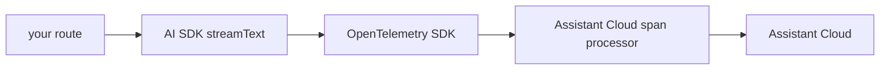

Assistant Cloud combines the browser's run report with the OpenTelemetry spans from your AI SDK route. The resulting run shows the client timing beside the server side model and tool call tree, with sampling calls and first token time in one trace.

The span processor from `assistant-cloud/telemetry` exports the AI SDK spans to `POST /v1/traces` with your API key, which never leaves the server, while `withAssistantCloudTraceMetadata` carries the same trace id to the browser's report. Assistant Cloud merges both halves into one run.

The setup, three steps in `instrumentation.ts` and the chat route, the receiver's rules and the merge are on [Traces](/docs/cloud/traces); the runtime side is on [AI SDK + assistant-ui](/docs/cloud/ai-sdk).
