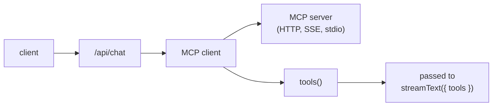

[MCP](https://modelcontextprotocol.io/) is an open protocol for exposing tools, resources, and prompts to LLMs. One MCP server can publish many tools (file system, GitHub, Slack, your own service) and any MCP-aware client can use them. The AI SDK has a built-in MCP client; this page is the wiring guide for plugging it into an assistant-ui app.

<AgentSetup product="guides/mcp" />

## How it works



The MCP client lives on the server inside your AI SDK route handler. It connects to one or more MCP servers, calls `tools()` to get a tool map, and hands that map to `streamText`. assistant-ui's existing tool-call UI (`ToolFallback`, or toolkit entries with `render`) renders the results.

<Callout type="info">
  If you use a `"use generative"` toolkit, spread `defineMcpToolkit({ ... })`
  in the toolkit and use `AISDKToolkit` in your route. It opens the MCP clients,
  merges their tools with your toolkit, and closes them for you.
</Callout>

## Setup

<Steps>
<Step>

### Install the MCP client

<InstallCommand npm={["@ai-sdk/mcp"]} />

For stdio transports (local dev only), also install the official MCP SDK:

<InstallCommand npm={["@modelcontextprotocol/sdk"]} />

</Step>
<Step>

### Connect to an MCP server

Set the server URL and any auth token your server requires:

```sh title=".env.local"
MCP_SERVER_URL=https://your-mcp-server.example/mcp
MCP_TOKEN=...
```

Then inside your AI SDK route handler, create the client with the transport that matches your server. **HTTP** is the production transport; **SSE** is the legacy streaming transport; **stdio** spawns a local process and is dev-only.

```ts title="app/api/chat/route.ts"
import { createMCPClient } from "@ai-sdk/mcp";

const mcpClient = await createMCPClient({
  transport: {
    type: "http",
    url: process.env.MCP_SERVER_URL!,
    headers: { Authorization: `Bearer ${process.env.MCP_TOKEN}` },
  },
});
```

For stdio:

```ts
import { createMCPClient } from "@ai-sdk/mcp";
import { StdioClientTransport } from "@modelcontextprotocol/sdk/client/stdio.js";

const mcpClient = await createMCPClient({
  transport: new StdioClientTransport({
    command: "node",
    args: ["./mcp-server/dist/index.js"],
  }),
});
```

</Step>
<Step>

### Define MCP servers in your toolkit

In a generative toolkit, spread `defineMcpToolkit({ ... })` with one entry per
MCP server. The entry key names the server connection; the MCP server publishes
the actual tool names. Use a readable key because it appears in connection,
tool-listing, and close errors for debugging.

```tsx title="app/toolkit.tsx"
"use generative";

import { defineMcpToolkit, defineToolkit } from "@assistant-ui/react";

export default defineToolkit({
  ...defineMcpToolkit({
    github: {
      type: "http",
      url: "https://mcp.example.com/mcp",
      connectionTimeout: 10_000,
    },
  }),
});
```

Use `{ server, disabled }` when a whole MCP server should stay configured but
not expose tools for the current request, such as missing credentials, feature
flags, or plan gating:

```tsx
defineMcpToolkit({
  docs: {
    server: {
      type: "http",
      url: process.env.DOCS_MCP_URL!,
    },
    disabled: !process.env.DOCS_MCP_URL,
  },
});
```

Use `tools` when the server should stay enabled but specific MCP tools should
be hidden from the model:

```tsx
defineMcpToolkit({
  docs: {
    server: {
      type: "http",
      url: process.env.DOCS_MCP_URL!,
    },
    tools: {
      deleteDocument: {
        disabled: !userCanDelete,
      },
    },
  },
});
```

If multiple MCP servers expose the same tool name, wrap the entry with
`{ server, prefix }` to give each server's tools distinct model-visible names:

```tsx
export default defineToolkit({
  ...defineMcpToolkit({
    docs: {
      server: { type: "http", url: "https://docs.example.com/mcp" },
      prefix: "docs_",
    },
    github: {
      server: { type: "http", url: "https://github.example.com/mcp" },
      prefix: "github_",
    },
  }),
});
```

If both servers publish `search`, the model receives `docs_search` and
`github_search` instead of an ambiguous duplicate.

Use `AISDKToolkit` in the route. It opens the MCP clients, merges their tools
with the rest of your toolkit, and closes them when you call `close()`:

`connectionTimeout` is optional and measured in milliseconds. Set it to fail
the server-side MCP readiness flow (`createMCPClient()` plus `tools()`) before
a bad URL or hanging local process can stall the route.

```ts title="app/api/chat/route.ts"
import { AISDKToolkit } from "@assistant-ui/ai-sdk";
import { openai } from "@ai-sdk/openai";
import { streamText, convertToModelMessages } from "ai";
import type { UIMessage } from "ai";
import toolkit from "../../toolkit";

export async function POST(req: Request) {
  const { messages, tools }: { messages: UIMessage[]; tools?: Record<string, any> } =
    await req.json();

  const aiToolkit = new AISDKToolkit({ toolkit });

  const result = streamText({
    model: openai("gpt-5.6-luna"),
    messages: await convertToModelMessages(messages),
    tools: await aiToolkit.tools({ frontend: tools }),
    onFinish: async () => {
      await aiToolkit.close();
    },
  });

  return result.toUIMessageStreamResponse();
}
```

</Step>
<Step>

### Wire the tools into the route

For manual MCP client control, `mcpClient.tools()` returns an object shaped
exactly like the `tools` argument of `streamText`. Spread it in alongside any of
your own tools, and close the client when the response finishes:

```ts title="app/api/chat/route.ts"
import { createMCPClient } from "@ai-sdk/mcp";
import { openai } from "@ai-sdk/openai";
import { streamText, convertToModelMessages } from "ai";
import type { UIMessage } from "ai";

export const maxDuration = 60;

export async function POST(req: Request) {
  const { messages }: { messages: UIMessage[] } = await req.json();

  const mcpClient = await createMCPClient({
    transport: {
      type: "http",
      url: process.env.MCP_SERVER_URL!,
      headers: { Authorization: `Bearer ${process.env.MCP_TOKEN}` },
    },
  });

  const tools = await mcpClient.tools();

  const result = streamText({
    model: openai("gpt-5.6-luna"),
    messages: await convertToModelMessages(messages),
    tools,
    onFinish: async () => {
      await mcpClient.close();
    },
  });

  return result.toUIMessageStreamResponse();
}
```

`onFinish` is the right place to call `close()`: it fires after the stream completes, so the connection stays open as long as the model is still calling tools.

</Step>
<Step>

### Combine multiple MCP servers

Each server has its own client. Spread their tool maps together:

```ts
const githubClient = await createMCPClient({
  transport: { type: "http", url: process.env.GITHUB_MCP_URL! },
});
const filesClient = await createMCPClient({
  transport: { type: "http", url: process.env.FILES_MCP_URL! },
});

const tools = {
  ...(await githubClient.tools()),
  ...(await filesClient.tools()),
};

// remember to close both in onFinish
```

If two servers expose tools with the same name, the later spread wins. Rename or scope as needed.

</Step>
<Step>

### Render results in the UI

Tool calls flow through the existing assistant-ui tool-call rendering. With no
setup, the bundled `<ToolFallback>` component renders the call name, arguments,
and result. To customize the appearance for a specific tool in a generative
toolkit, add an `externalTool()` renderer whose key matches the MCP tool name:

<PlatformTabs>
<Tab value="React">

```tsx title="app/toolkit.tsx"
"use generative";

import { defineMcpToolkit, defineToolkit, externalTool } from "@assistant-ui/react";

type Args = { repo: string; number: number };
type Result = { title: string; state: string; url: string };

export default defineToolkit({
  ...defineMcpToolkit({
    github: { type: "http", url: "https://mcp.example.com/mcp" },
  }),
  github_get_issue: {
    execute: externalTool(),
    render: ({ args, result }: { args: Args; result?: Result }) => (
      <div className="rounded border p-3">
        <div className="font-mono text-sm">{args.repo}#{args.number}</div>
        {result && (
          <a href={result.url} className="underline">
            {result.title} ({result.state})
          </a>
        )}
      </div>
    ),
  },
});
```

</Tab>
<Tab value="React Native">

```tsx title="components/GitHubIssueToolUI.tsx"
import { defineToolkit } from "@assistant-ui/react-native";
import { Linking, Pressable, Text, View } from "react-native";

type Args = { repo: string; number: number };
type Result = { title: string; state: string; url: string };

export const toolkit = defineToolkit({
  github_get_issue: {
    type: "backend",
    render: ({ args, result }: { args: Args; result?: Result }) => (
      <View style={{ borderWidth: 1, borderRadius: 6, padding: 12 }}>
        <Text style={{ fontFamily: "Menlo", fontSize: 13 }}>
          {args.repo}#{args.number}
        </Text>
        {result && (
          <Pressable onPress={() => Linking.openURL(result.url)}>
            <Text style={{ textDecorationLine: "underline" }}>
              {result.title} ({result.state})
            </Text>
          </Pressable>
        )}
      </View>
    ),
  },
});
```

</Tab>
<Tab value="React Ink">

```tsx title="components/GitHubIssueToolUI.tsx"
import { defineToolkit } from "@assistant-ui/react-ink";
import { Box, Text } from "ink";

type Args = { repo: string; number: number };
type Result = { title: string; state: string; url: string };

export const toolkit = defineToolkit({
  github_get_issue: {
    type: "backend",
    render: ({ args, result }: { args: Args; result?: Result }) => (
      <Box borderStyle="round" paddingX={1} flexDirection="column">
        <Text>
          {args.repo}#{args.number}
        </Text>
        {result && (
          <Text>
            {result.title} ({result.state}) — {result.url}
          </Text>
        )}
      </Box>
    ),
  },
});
```

</Tab>
</PlatformTabs>

Register the toolkit once with `Tools({ toolkit })`. Renderer keys such as
`github_get_issue` must match the tool names your MCP server publishes.

```tsx title="app/components/RuntimeProvider.tsx"
"use client";

import { AssistantRuntimeProvider, AuiConfig, Tools } from "@assistant-ui/react";
import { useChatRuntime } from "@assistant-ui/ai-sdk";
import type { ReactNode } from "react";

import { toolkit } from "./GitHubIssueToolUI";

export function MyRuntimeProvider({ children }: { children: ReactNode }) {
  const runtime = useChatRuntime();
  const config = AuiConfig({ tools: Tools({ toolkit }) });
  return (
    <AssistantRuntimeProvider
      runtime={runtime}
      config={config}
    >
      {children}
    </AssistantRuntimeProvider>
  );
}
```

`useChatRuntime()` targets `/api/chat` by default. To point at a different endpoint or customize requests, see [Custom transport](/docs/runtimes/ai-sdk/v7#custom-transport).

</Step>
<Step>

### Require approval before an MCP tool runs

MCP tools execute on the server, so approval is a server-side tool gate, not a `humanTool()` result. Gate the call with AI SDK v7's call-level `toolApproval` option, keyed by the tool's model-visible name. The tool name stays the same, so your custom renderer or the default `ToolFallback` receives `approval` and `respondToApproval` like any other backend tool:

```ts title="app/api/chat/route.ts"
const tools = await mcpClient.tools();

const result = streamText({
  model: openai("gpt-5.6-luna"),
  messages: await convertToModelMessages(messages),
  tools,
  toolApproval: {
    github_delete_repository: "user-approval",
  },
  onFinish: async () => {
    await mcpClient.close();
  },
});
```

With `AISDKToolkit`, pass the same `toolApproval` option alongside the tools returned by `await aiToolkit.tools(...)`; key it by the prefixed name when the entry sets one.

On the client, let the AI SDK send the recorded approval decision back to the
route:

```tsx title="app/components/RuntimeProvider.tsx"
import { lastAssistantMessageIsCompleteWithApprovalResponses } from "ai";

const runtime = useChatRuntime({
  sendAutomaticallyWhen: lastAssistantMessageIsCompleteWithApprovalResponses,
});
```

Use this pattern for backend-owned actions such as deleting, writing, deploying, or calling privileged MCP tools. Use `humanTool()` only when the user supplies the tool result itself. For custom approval UIs, see [Server-side approval gates](/docs/tools/tool-ui#server-side-approval-gates); for the full wire setup, see [Server-side tool approval](/docs/runtimes/ai-sdk/v7#server-side-tool-approval).

</Step>
<Step>

### Run and verify

Start the app and trigger a tool call (e.g., ask the assistant to do something the MCP server can do). Confirm:

- The tool call appears in the chat with the expected arguments.
- The result renders (either via your custom `ToolUI` or the fallback).
- No connection leaks: the MCP client closes after each response. If you see open connections accumulating, check `onFinish`.

</Step>
</Steps>

## Notes

- **Server-side only.** The MCP client uses Node APIs (sockets, optionally child processes). Never instantiate it in client code.
- **Per-request lifecycle.** A fresh client per request keeps connection state simple. For high-throughput servers, pool clients yourself with care: the AI SDK's `tools()` call assumes the connection is alive when `streamText` runs.
- **Sampling.** If your MCP server uses `sampling/createMessage` (lets the server ask the LLM mid-call), assistant-cloud users can instrument it via [`instrumentMcpSampling`](/docs/cloud) for observability. This is independent of the wiring above.
- **Transport choice.** HTTP for any networked server. SSE only if the server doesn't speak HTTP. stdio is for local development against an MCP server in your monorepo.

## Related

<Cards>
  <Card
    title="AI SDK runtime"
    description="The runtime that ferries MCP tool calls to the chat UI."
    href="/docs/runtimes/ai-sdk/v7"
  />
  <Card
    title="Tools and tool UI"
    description="Build custom renderers for tool calls and approvals."
    href="/docs/tools/defining-tools"
  />
</Cards>
